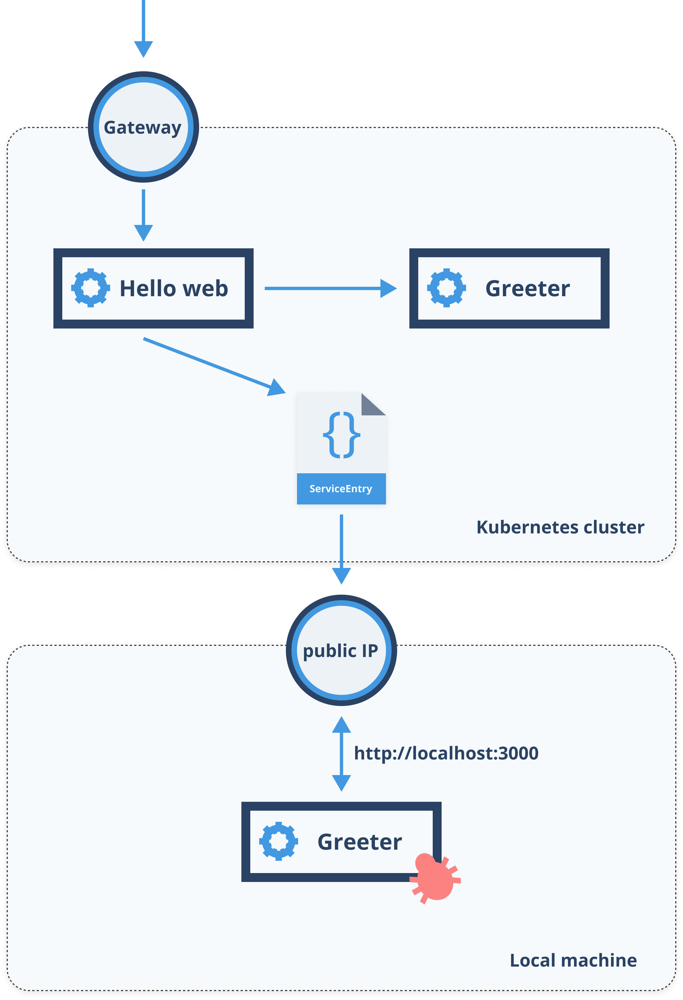
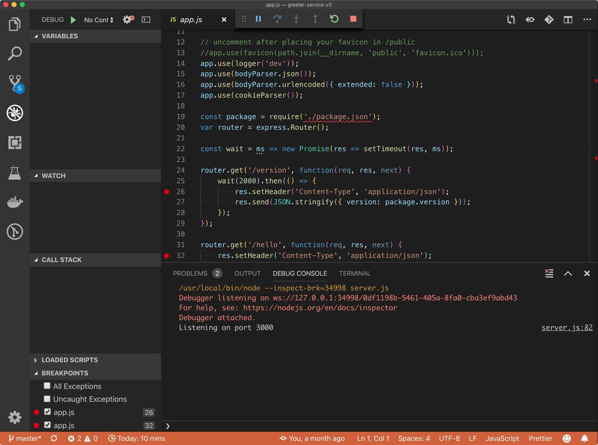
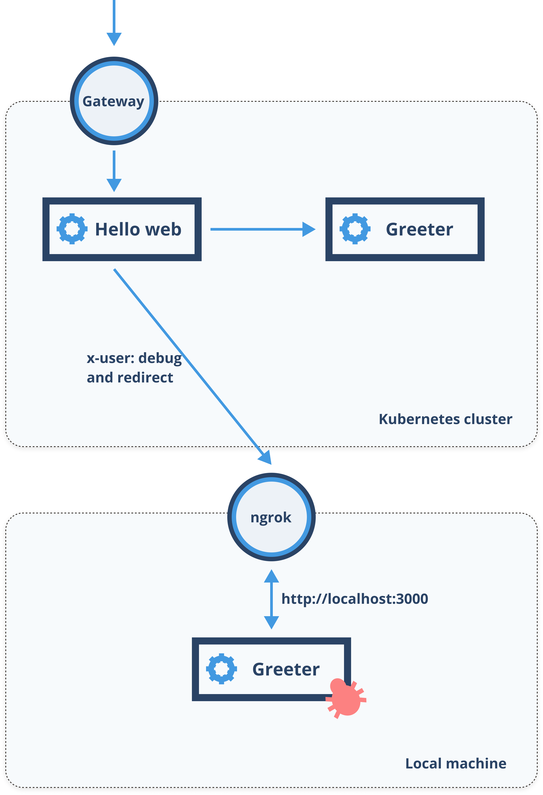

In this blog, we will explain a couple of approaches you can use to debug services running inside your Kubernetes cluster, without deploying the version of the service you want to debug to the cluster.

### Using traffic mirroring

One way to debug the services is to use traffic mirroring. The way traffic mirroring works is that it copies the real traffic and sents it to the mirrored version. Any responses from the mirrored service get dropped, so real traffic is not being affected at all.

The idea is that you have the source code to the service opened in your development IDE. You start the debugger and then, instead of manually interacting with the service or sending the requests to the service running locally, you make a request to the production service. The traffic from that service gets mirrored to the service running locally on your machine.

Since you will be running the service under the debugger on your machine, we can use the service entry resource to point to the service running on your computer, then mirror the traffic to that. For this approach to work, you will have to expose the service running on your machine through a public IP that can be accessible from the cluster. We will then use that IP as an endpoint in the Service entry resource. The diagram below shows for this idea.



The traffic or request comes in to through the Hello web and gets mirrored to the external service, defined by the service entry. That service entry is using the static resolution to route to the IP address that's exposing the locally running Greeter service to the public.

Let's deploy Hello web service:

```sh
cat << EOF | kubectl apply -f -
apiVersion: apps/v1
kind: Deployment
metadata:
  name: helloweb
  labels:
    app: helloweb
    version: v1
spec:
  replicas: 3
  selector:
    matchLabels:
      app: helloweb
      version: v1
  template:
    metadata:
      labels:
        app: helloweb
        version: v1
    spec:
      containers:
        - name: web
          image: learnistio/hello-web:1.0.0
          imagePullPolicy: Always
          ports:
            - containerPort: 3000
          env:
            - name: GREETER_SERVICE_URL
              value: 'http://greeter-service.default.svc.cluster.local:3000'
---
kind: Service
apiVersion: v1
metadata:
  name: helloweb
  labels:
    app: helloweb
spec:
  selector:
    app: helloweb
  ports:
    - port: 3000
      name: http
EOF
```

Let's deploy the Greeter service:

```sh
cat << EOF | kubectl apply -f -
apiVersion: apps/v1
kind: Deployment
metadata:
  name: greeter-service-v1
  labels:
    app: greeter-service
    version: v1
spec:
  replicas: 3
  selector:
    matchLabels:
      app: greeter-service
      version: v1
  template:
    metadata:
      labels:
        app: greeter-service
        version: v1
    spec:
      containers:
        - name: svc
          image: learnistio/greeter-service:1.0.0
          imagePullPolicy: Always
          ports:
            - containerPort: 3000
---
kind: Service
apiVersion: v1
metadata:
  name: greeter-service
  labels:
    app: greeter-service
spec:
  selector:
    app: greeter-service
  ports:
    - port: 3000
      name: http
EOF
```

Let's deploy the Virtual service for the Hello web:

```sh
cat << EOF | kubectl apply -f -
apiVersion: networking.istio.io/v1alpha3
kind: VirtualService
metadata:
  name: helloweb
spec:
  hosts:
    - '*'
  gateways:
    - gateway
  http:
    - route:
      - destination:
          host: helloweb.default.svc.cluster.local
          port:
            number: 3000
EOF
```

This gives us a working Hello web and with Greeter service v1. As a next step, let's deploy a virtual service that routes 100% of the traffic to the v1 version of the greeter service and mirrors the traffic to a service we are calling *greeter-service.ext* - we will define this later.

```sh
cat <<EOF | kubectl apply -f -
apiVersion: networking.istio.io/v1alpha3
kind: VirtualService
metadata:
  name: greeter-service
spec:
  hosts:
    - greeter-service
  http:
    - route:
      - destination:
          host: greeter-service
          port:
            number: 3000
      mirror:
        host: greeter-service.ext
      mirrorPercent: 100
EOF
```

To mirror traffic to the service running on the local machine, we will need to create a ServiceEntry for the  *greeter-service.ext* and use a static IP address to reach it. To get the static IP, we need to launch the debug version of the service locally and then expose it through the public IP.

Open the source to the greeter service in your favorite code editor (I am using Visual Studio Code), and start the service with debugging. If you are using Visual Studio Code, you can set the breakpoints, press the F5 button, pick Node.JS as an option and the editor will automatically run the service under the debugger. Your Visual Studio Code instance should look similar to the one in the figure below.



If you open your browser at *http://localhost:3000/hello* or */version* the debugger will break at the set breakpoint. This is what we want to happen, but the traffic hits the production service running in the cluster. 

As a next step, we need to expose the *localhost:3000* and use IP address where the service is exposed in the ServiceEntry resource. The ServiceEntry resource would look like this (remember to replace the **IP_ADDRESS** with an actual IP address where your service is exposed on):

```sh
cat <<EOF | kubectl apply -f -
apiVersion: networking.istio.io/v1alpha3
kind: ServiceEntry
metadata:
  name: greeter-service.ext
spec:
  hosts:
  - greeter-service.ext
  ports:
  - number: 80
    protocol: HTTP
    name: http
  resolution: STATIC
  location: MESH_EXTERNAL
  endpoints:
  - address: [IP_ADDRESS]
    ports:
      http: 80
EOF
```

With these resources deployed, you can send a request to the Hello web (e.g. http://localhost), and you will see the breakpoint will get hit in your editor.

### Using Kubernetes service and Istio

The previous approach can be awkward, mainly because you need a public IP address to be able to use the service entry to point to it. The second approach I am going to explain uses *ngrok* and a combination traffic rules to redirect traffic meant for debugging to the version of the service running locally on your machine. The figure below explains this approach in more detail. 



At first glance, the approach looks similar to the previous one. The difference is that in this case, we won't be mirroring the production traffic, which gives us more control over debugging. Instead, we will use a specific header (**x-user**) and utilize the redirect functionality in the virtual service to direct traffic to the debug version of the service. The service running locally will be exposed through the public URL using *ngrok*.

If you have the Hello web, corresponding virtual service and a greeter service v1 as well as the gateway deployed, you can continue. Otherwise, look at the previous section for commands to deploy those resources.

Start the local greeter service and run it under the debugger, then launch *ngrok* with the following command: 

```sh
ngrok http 3000
```

Running this command exposes your *localhost:3000* on a publicly available address. When I ran the command, the external URL I got was *http://97260680.ngrok.io*. Try opening the ngrok URL in the browser, appending either */version* or */hello* to the URL to double-check everything still works - the breakpoint you have set should get hit. Make sure this works before continuing. 


Let's create the virtual service and create the match condition and redirect:

```sh
cat <<EOF | kubectl apply -f -
apiVersion: networking.istio.io/v1alpha3
kind: VirtualService
metadata:
  name: greeter-service
spec:
  hosts:
  - greeter-service
  http:
  - match:
    - headers:
        x-user:
          exact: debug
    redirect:
      authority: 97260680.ngrok.io
  - route:
    - destination:
        host: greeter-service
        port:
          number: 3000
EOF
```

The above virtual service tries to match the *x-user* header to *debug* value and if there's a match, it does a redirect to the URL specified in the *authority* field - this is the URL where our service running locally is exposed on. If you deploy this, you can send the following request using curl to see the breakpoint hit in your service:

```sh
$ curl -v -H "x-user: debug" http://localhost
```

Similarly, visiting the URL in from a browser and setting a header will trigger a breakpoint as well. If you remove the *x-user* header or set it to a different value, the breakpoint won't get hit and the service running inside the cluster will get invoked instead.