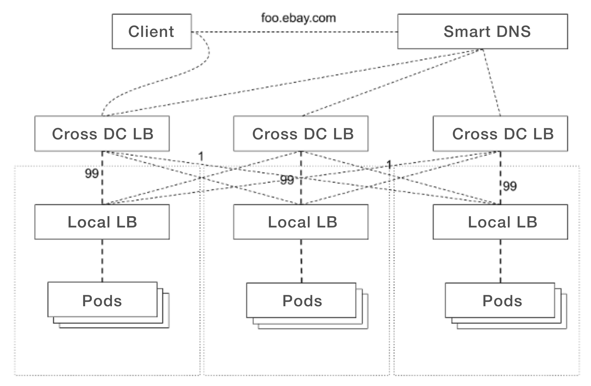
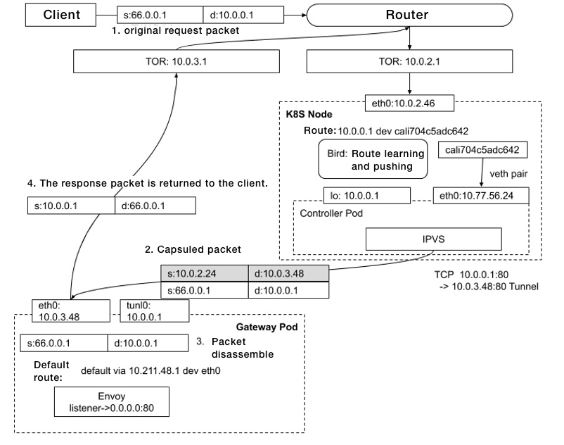
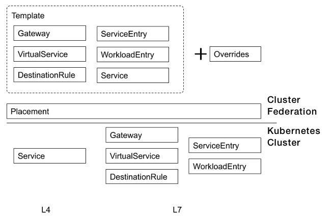

As a centralized cloud platform, Kubernetes manages multiple heterogeneous applications, including online services, big data, and backend searches. The number of clusters reaches up to the hundreds. In large clusters, thousands of microservices and hundreds of thousands of pods are run in a single cluster. Needless to say, different types of applications have different traffic management needs. The question then arises: how do we address these different needs with a centralized model? In fact, this is the biggest challenge that eBay has been seeking to tackle for years.

Taking cloud applications as an example, to meet the high availability requirements across data centers, the network topology for production-level applications can be summarized as follows:

- eBay adopts an active-active data center network topology. Therefore, all production applications must deploy across three data centers.
- To meet the high availability requirements of a single cluster, all applications must deploy with multiple copies, and set load balancer configurations.
- Microservices are implemented across the entire site. To ensure there is high availability, service-to-service communications are primarily based on north-south traffic.
- For core applications, in addition to the local load balancing configuration of the cluster, it is also necessary to configure the cross-data center load balancer, and use weight control to transfer 99% of requests to the local data center, and 1% of traffic to cross-regional data centers. When all local service instances of an application fail, the operations and maintenance personnel can immediately restrict members of the cross-data center load balancer that point to 99% of the local traffic, and the traffic can be diverted to other data centers in seconds. In this way, business operations can run as usual. There are various causes for the failure of local service instances, including releases, hardware failures, firewalls, routers, and other network equipment changes.

## Deployment Model

eBay has multiple data centers. Each data center contains multiple availability zones with independent power supply and cooling systems. Each zone deploys multiple Kubernetes clusters. As the network latency of each zone is relatively small, the Istio control plane is built using the availability zone as the smallest management domain. In each availability zone, we select a Kubernetes cluster as the gateway cluster, deploy Istio Primary, and install Istio Remote in other clusters in the same availability zone. In this configuration, the service-to-service communications in multiple clusters in the same availability zone are all converted into east-west traffic, and cross-availability zone communications must pass through the Istio gateway.

This Istio deployment model is primarily based on the Kubernetes operating model. Different Kubernetes clusters are built with computing nodes in different availability zones. Such configuration makes possible the low latency of service access in the same mesh and the high availability of the scale of the service mesh, allowing for efficient management and control of the fault domain.

## Access Gateway

As an Internet company, the most important issue in traffic management is how to receive user requests from the public network. Transferring requests initiated by clients from outside to within the cluster is the primary concern to be addressed in traffic management.

Under a software-only architecture, the load balancing components consist of a Layer 4 load balancer and a Layer 7 API gateway. The Layer 4 load balancer is responsible for providing the virtual IP address of the service, receiving client requests, and forwarding client requests to the upstream instance. The Layer 7 API gateway is responsible for advanced routing functions based on application layer protocols, such as TLS offloading, access path redirections, and modification of HTTP protocol headers.

### Layer 4 Gateway

The main technical approach of the Layer 4 gateway is to forward user requests from external clients to virtual IP addresses, and then to the cluster with the use of technologies such as network address translation (NAT) or tunnel. NAT is the most commonly used method, as it is easy to use and troubleshoot. Although IP tunnel is slightly more complicated to configure than NAT, it is often used to implement DSR. Not only does it retain the original IP address, but it also has a higher data forwarding efficiency, making it a better solution than NAT.

Under the Kubernetes architecture, the control panel of the Layer 4 load balancers can be defined as Kubernetes pods to implement advanced functions, such as failover, expansion, and contraction. Further, with the use of Linux's own components like IPVS, Layer 4 data packet forwarding can be implemented.

The Layer 4 gateway uses the Kubernetes Service Controller to complete the following configurations:

- Virtual IP address assignment. After the user creates a service object, the Service Controller must select an available virtual IP address from the pre-configured public network IP to assign to the service.
- Configure the IPVS interface to complete the configuration of load balancing rules.
- In routing announcements, the virtual IP address is different from the IP of the physical device. It is not tied to any physical device. Rather, it is based on the BGP protocol and ECMP, which allows multiple devices to configure routing information with the same IP address. After the Service Controller assigns a virtual IP address to the service and configures the IPVS rules, the controller must also announce the virtual IP address with reference to the configured nodes. Based on the BGP protocol, other routers in the data center can learn how to forward the virtual IP address to the gateway node. With the support of ECMP, multiple Layer 4 load balancing components share the same behavior. In other words, they configure based on the same rules and announce the same IP address. Further, each instance carries the traffic of the virtual IP address. Compared with a hardware load balancer in active-standby mode, in this use case, all load balancing nodes are in the active mode, and there is no additional hardware overhead of standby devices.

The core function of each node is the configuration of load balancing rules, which encompass these features:

**N-tuple Hashing**: Based on the source IP, source port, destination IP, destination port, and the N-tuple hash of the protocol, it is guaranteed that the same upstream instance is always selected for the same connection. The ECMP hash algorithm of the router is related to the device being used. The same N-tuple may be forwarded to multiple destinations. Here, a Layer 4 load balancer is used. As long as re-hashing is performed on the IPVS host according to the N-tuple, regardless of which IPVS instance the request is forwarded to, it will be forwarded to the same upstream server. The hash results calculated by all instances are consistent, so there is no need to synchronize the states between multiple IPVS instances. When a node fails, other nodes can forward the request to the same upstream.

**Consistent Hashing**: The N-tuple-based hash algorithm will try to split the request evenly among multiple upstream servers. In Kubernetes, upstream servers exist in the form of pods, and scaling and failover commonly occur. In the ordinary hash algorithm, changing the target entails a lot of rehash. After adopting the consistent hash algorithm, only the modified part needs to be re-hashed, which reduces the CPU overhead needed for a large number of hash calculations.

**Connection Tracking**: The Connection Tracking table is used to record the results of recently connected backend selections. When the IPVS module processes data for load balancing, it first queries the connection table. If it is found that the N-tuple already has a corresponding target instance and the instance is healthy, the result will be directly reused. However, if it does not exist, or the corresponding instance has an irregular status, the result will be recalculated based on the consistent hash, and the calculation result will be saved in the connection table for request data reuse at a later stage.

**Data Packets**: After selecting the corresponding upstream server, the IPVS module starts to process data packets. The kernel protocol stack processes data packets based on NAT or tunnel. The problem with NAT is that the user's original IP will be lost. Here, an enhanced version of the tunnel mode is selected. The IPVS module will keep the original data packets. A layer of IP header will be encapsulated outside the original data packet. The source of the inner header of the data packet is the client IP and the destination is the virtual IP address of the service. The source of the outer header is IPVS PodIP, and the destination is the upstream server PodIP. Then, based on the IP-over-IP protocol, data will be sent to the upstream.

**Health Check**: Health check is a basic function in the load balancer. It is also required in our software load balancer. The Seasaw repository has APIs that support multiple health check modes. Simply call the interface in the controller to perform health checks on all upstream targets. If an upstream server fails in the health check, the relevant forwarding rules in IPVS must be deleted.

There are multiple ways to implement software-based Layer 4 load balancing. The IPVS module based on the operating system is the most direct and cost-effective solution. Needless to say, IPVS needs to rely on the operating system protocol stack during the processing of data, and the forwarding efficiency is not very high. If greater traffic processing capacity is required, there are many data plane acceleration technologies available, such as DPDK and XDP.

### Layer 7 Application Gateway

Using the Layer 4 load balancer in conjunction with the ingress gateway powered by Istio, a highly available access solution for inbound traffic can be implemented throughout the site.

As the forwarding target of the Layer 4 load balancer, the Layer 7 API gateway needs to cooperate to complete the tunneling configurations. Since the Layer 4 load balancer is based on the IP tunnel configuration forwarding rules, when it forwards data, it uses the data packet sent by the IP-over-IP protocol as the target. The Envoy pod must disassemble the IPIP packet after receiving the request. This requires creating a device of type IPIP in the Enovy pod and binding a virtual IP address.

The main site of a website built with a microservice architecture usually consists of an aggregate of dozens to hundreds or even thousands of microservices. Different microservices are registered under the same main domain name with different access paths. At the same time, the API gateway will have some general access control policies. For example, the external IP cannot access the path ending with /admin. These access controls are well supported in Istio.

After Envoy receives a request, it will forward the request to the relevant target according to the established Layer 7 forwarding rules. For the edge gateway, these targets are usually the virtual IP addresses of the services in the cloud. After Envoy receives the result of cloud processing, it has to forward the request back to the client, since the request is an IPIP packet when it arrives at the Envoy pod. After the operating system uninstalls the outer packet header, the inner data packet header is the client IP and service virtual IP address. When Envoy returns a packet, it only needs to rotate the source and destination addresses before sending data. The response packet can be sent directly to the client via the default gateway, bypassing IPVS, which is the well-known DSR mode.

## Traffic Management

### Protocol Upgrade

For applications that access Istio, mTLS is enabled by default. For east-west traffic, the service-to-service communications are naturally encrypted, and the security level of intra-site traffic has been improved.

### The Challenges of Scaling Up

The power of Istio lies in the centralized management and control of east-west and north-south traffic through a set of models. For east-west traffic, there are not too many functions that need to be customized. The focus of our work in the production process is the construction of pipelines that support continuous integration and releases, as well as conducting a large number of performance tests. Based on the results of scale tests and performance tests, we define the Istio operation and maintenance model. For very large clusters, Istio faces many challenges.

Istiod discovers all services in the cluster by default, and builds an Envoy cluster for the port of each service. If the sni-dnat mode is enabled, Istiod builds an Envoy cluster that conforms to the domain name specification. For super clusters with a large number of services, the Envoy configuration would become enormous. In the earlier version, we experienced a lot of failures that caused the access gateway to become completely unavailable when the configuration generated by Istiod exceeded the threshold that Envoy can withstand with more than 8000 services.

In subsequent versions of Istio, the ExportTo property is added to Istio objects to achieve visibility control. By exporting the accessible services only to the required microservices, it allows us to control the configuration scale of Envoy, reduce Envoy's footprint, and improve push efficiency.

Although the configurations of Envoy can be streamlined through ExportTo, the Istio control panel will proceed to discover all services in the cluster. For super clusters, Istiod still faces the problem of excessive resource usage and low processing efficiency due to the large number of objects that require monitoring and processing. The community version 1.9 improves Istiod's ability to filter monitored objects based on namespace labels. This feature helps solve the scale and performance problems of the Istiod control panel under a super cluster scale.

### Automating Access Gateway Certificates

Based on Envoy's discovery mechanism SDS, Istio can implement certificate management for website domain names. However, it requires administrators to put the certificate in the Istio root namespace in advance, and, when creating an Istio gateway object, to reference the predefined certificate information by defining credentialName. This applies to scenarios where the same Kubernetes cluster only provides one domain name. But where domain names are dynamically created, such a semi-automatic operation and maintenance mode is clearly not possible. A custom SDS must be implemented to connect with the enterprise certificate issuance center. The solution can be understood as an automatic issuance of the certificate through the custom controller to monitor the hosts attribute in the Istio gateway object, and the certificate is pushed to Envoy through SDS .

### Automating Access Domain Names

The same application gateway can implement the access of multiple applications with different domain names. For applications with different domain names, the domain name configurations must be automated. In order to do this, a NameService object is defined, allowing users to define FQDN, TTL, different DNS Providers, target services, and so on. After the target service is configured, the domain name configuration can be automatically completed.

## Management Model Abstraction and Advanced Flow Control

Istio's model abstraction is highly flexible, and different network topologies can be defined for applications through Istio objects. However, it also faces many challenges:

- Faced with dozens of availability zones and hundreds of Kubernetes clusters, it is simply not practicable for users to configure each cluster. Doing so would result in management chaos. Customers would be forced to work with excessive infrastructure details. The computing resources are difficult to control, and the configurations lack uniformity. These factors increase the likelihood of system failure caused by any changes to be made.
- Istio objects have no state properties, and it is difficult to visually obtain information, such as whether the configuration is correct, and whether a push has been completed.
- The health check mechanism of the multipath software access gateway. Kubernetes implements multi-cluster management through cluster federation. We have implemented a set of Federated AccessPoint based on cluster federation. At its core, it defines the service object that describes load balancing in Kubernetes and the Gateway, VirtualService, DestinationRule, ServiceEntry, WorkloadEntry, and other objects that describe network traffic in Istio as templates, with AvailabilityZone or Kubernetes Cluster as the deployment target, and support cluster federation objects with the override property.

This traffic model comes with wide-ranging policy controls, including:

- PlacementPolicy control: Users can select the target cluster to complete the traffic configuration, and even select the associated FederatedDeployment object, so that AccessPoint can automatically discover the target cluster and complete the configuration.
- Status reports: Status reports include the gateway virtual IP address, gateway FQDN, certificate installation status and version information, and whether the routing strategy is configured. This remedies Istio's shortcomings and makes the network configuration status of any application deployed on Istio easy to see.
- Release strategy control: A single-cluster gray release can be implemented for multi-cluster configurations. The release can be automatically suspended, after which the administrator would verify that the changes of a single cluster are correct, and then proceed with the release. Through this mechanism, failures caused by global traffic changes are effectively prevented.
- AccessPoints with different domain names may have different Layer 4 gateway virtual IP addresses to achieve Layer 4 network isolation based on IP addresses.
- Based on cross-regional traffic control, Istio implements workload locality-based failover strategy and weighting strategy management. Traffic management can be achieved across different regions while also maintaining a high level of availability.

## Opportunities and Challenges Faced by Istio

Istio has some clear advantages. It tries to uniformly manage north-south traffic and east-west traffic. This makes it possible to evolve the microservice architecture from an API gateway to a service mesh based on the same technology stack. These distinctive features make Istio stand out in the community as the most active open source service mesh project.

- Portability: It supports Kubernetes as well as virtual platforms OpenStack and Consul.
- A cross-language service mesh platform: It brings together Java, Scala, Nodejs, and various other languages.
- Centralized management of north-south and east-west traffic: Unifying the service mesh and API gateway user experience, and reduction of operating costs.
- Inherent security, automated certificate management, as well as seamless integration of authentication and authorization.
- Full functional support: All visible functions of the API gateway are supported.
- Strong community support: Google uses Istio as the next-generation microservice management platform, and cloud computing giants such as IBM, Microsoft, Huawei, and Alibaba are actively participating in the promotion and production of the Istio project.

Nonetheless, as an emerging project that manages highly complex traffic in distributed systems, Istio also faces many challenges:

- Scale and efficiency: The scale of clusters supported by Kubernetes is getting larger and larger. Production clusters with thousands of computing nodes, hundreds of thousands of pods, and thousands of services are becoming more and more common. Istio still faces many challenges in supporting large-scale cluster scenarios and the optimization of codes. Istio's multi-cluster deployment will even double the magnitude. A major issue that Istio now faces is how to support super clusters.
- Complexity: Istio is a complex system in terms of both its control plane and its model abstraction. More functional modules means higher complexity in operation and maintenance.
- Integration with the existing services of the enterprise: Istio production must be integrated with the existing services of the enterprise, such as the CA, tracing system, and monitoring platform.
- Migration of existing businesses: Many companies already have microservice systems based on open source frameworks such as SpringCloud. This system has already supported many functions such as circuit breaker current limiting and API gateways, which are the same as those provided by Istio. The key questions are whether to migrate these existing businesses to Istio, and how to migrate.

Istio enjoys strong support from the community and has been endorsed by many industry giants and well-known projects. It can remedy Kubernetes' functional deficiencies at the traffic management level, making it an all-round microservice management platform. We are confident that Istio has a promising future.

For more Kubernetes- and Istio-based production practices, please see "The Road to Kubernetes Production Practice” (Chinese only). The book is currently on sale at JD.com for up to a 50% off.

Fanjie Meng is a senior architect at eBay, responsible for architecture and development of Kubernetes in enterprise implementation, focusing on networking, multi-clustering, service governance and service mesh, etc. A Kubernetes contributor, Fanjie participated in the development of community cluster federation and service controller refactoring.

