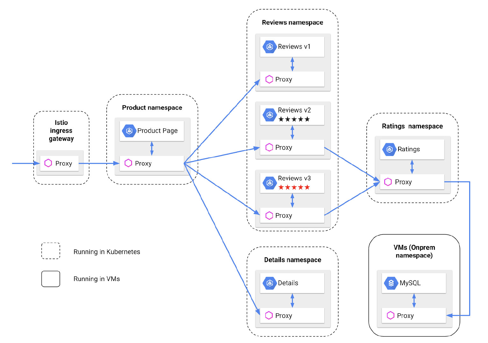

GetIstio is an Istio distribution open sourced by Tetrate. It mainly solves the following problems of Istio.

- Istio lifecycle management
- Tested and safe Istio configurations
- Native integrations into the computing environment
- Learning curve and ongoing support

To learn more about GetIstio, please visit https://getistio.io.

This article will start by taking you through a hands-on installation and use of GetIstio on GKE, including:

- Installing Istio 1.7 on GKE
- Adding a virtual machine to the mesh
- Deploying the Bookinfo example
- Integrating a virtual machine for testing
- Upgrading Istio to 1.8

From the above, you will learn about Istio's deployment architecture, basic functionality, and operation. 

This blog is only for Istio 1.7, for 1.8 the steps to integrate a virtual machine have changed, please refer to the [Istio documentation](https://istio.io/latest/docs/setup/install/virtual-machine/).

## Prerequisite

In order to complete the do-it-yourself process, you will need to prepare the following environment.

- A Google Cloud account with a sufficient balance in it
- A local installation of the `gcloud` tool

## Setup Istio

Let’s set up Istio 1.7.5 with GetIstio.

```sh
curl -sL https://istio.tetratelabs.io/getmesh/install.sh | bash
getistio fetch 1.7.5
```

Setup the [demo profile](https://istio.io/latest/docs/setup/getting-started/)（including Ingress gateway, egress gateway and Istiod）:

```text
getistio istioctl install --set profile=demo --set values.global.meshExpansion.enabled=true
Detected that your cluster does not support third party JWT authentication. Falling back to less secure first party JWT. See https://istio.io/docs/ops/best-practices/security/#configure-third-party-service-account-tokens for details.
✔ Istio core installed
✔ Istiod installed
✔ Ingress gateways installed
✔ Egress gateways installed
✔ Installation complete
```

To see the pods under `istio-system` namespace:

```text
kubectl get pod -n=istio-system
NAME                                   READY   STATUS   RESTARTS   AGE
istio-egressgateway-695f5944d8-wdk6s    1/1     Running   0         67s
istio-ingressgateway-5c697d4cd7-4cgq7   1/1     Running   0         67s
istiod-59747cbfdd-sbffx                 1/1     Running   0         106s
```

Enable sidecar auto injection:

```sh
kubectl label namespace bookinfo istio-injection=enabled
```

Deploy[ Bookinfo ](https://istio.io/latest/docs/examples/bookinfo/)sample:

```text
kubectl create ns bookinfo
kubectl apply -n bookinfo -f samples/bookinfo/platform/kube/bookinfo.yaml
service/details created
serviceaccount/bookinfo-details created
deployment.apps/details-v1 created
service/ratings created
serviceaccount/bookinfo-ratings created
deployment.apps/ratings-v1 created
service/reviews created
serviceaccount/bookinfo-reviews created
deployment.apps/reviews-v1 created
deployment.apps/reviews-v2 created
deployment.apps/reviews-v3 created
service/productpage created
serviceaccount/bookinfo-productpage created
deployment.apps/productpage-v1 created
```

Verify the deployment complete.

```sh
kubectl exec "$(kubectl get pod -n bookinfo -l app=ratings -o jsonpath='{.items[0].metadata.name}')" -n bookinfo -c ratings -- curl -s productpage:9080/productpage | grep -o "<title>.*</title>"
```

Normally you will see a display that looks like this:

```text
<title>Simple Bookstore App</title>
```

Enable the access from outside of the mesh:

```sh
kubectl -n bookinfo apply -f samples/bookinfo/networking/bookinfo-gateway.yaml
export INGRESS_PORT=$(kubectl -n istio-system get service istio-ingressgateway -o jsonpath='{.spec.ports[?(@.name=="http2")].nodePort}')
export SECURE_INGRESS_PORT=$(kubectl -n istio-system get service istio-ingressgateway -o jsonpath='{.spec.ports[?(@.name=="https")].nodePort}')
echo "$INGRESS_PORT"
echo "$SECURE_INGRESS_PORT"
export INGRESS_HOST=$(kubectl -n istio-system get service istio-ingressgateway -o jsonpath='{.status.loadBalancer.ingress[0].ip}')
echo "$INGRESS_HOST"
export GATEWAY_URL=$INGRESS_HOST:$INGRESS_PORT
echo "$GATEWAY_URL"
```

Apply the default DestinationRule.

```sh
kubectl apply -n bookinfo -f samples/bookinfo/networking/destination-rule-all.yaml
```

## Adding a virtual machine to Istio mesh

We will install MySQL on the VM, and configure it as a backend for the ratings service. Eventually, the service topology diagram for the [bookinfo](https://istio.io/latest/docs/examples/bookinfo/) example will look something like this.



We will create a virtual machine in Google cloud and add it to the Istio Mesh. Assuming the name of the VM instance is instance-1, first create a certificate for the VM.

```sh
kubectl create secret generic cacerts -n istio-system \
    --from-file=samples/certs/ca-cert.pem \
    --from-file=samples/certs/ca-key.pem \
    --from-file=samples/certs/root-cert.pem \
    --from-file=samples/certs/cert-chain.pem
```

Setup Istio mesh expansion.

```sh
getistio istioctl install \
    -f manifests/examples/vm/values-istio-meshexpansion.yaml
```

Execute the following command in the Cloud shell to generate the configuration file for the virtual machine expansion.

```sh
VM_NAME=instance-1
VM_NAMESPACE=vm
WORK_DIR=vm
SERVICE_ACCOUNT=instance-1
cat <<EOF> "${WORK_DIR}"/vmintegration.yaml
apiVersion: install.istio.io/v1alpha1
kind: IstioOperator
spec:
 values:
   global:
     meshExpansion:
       enabled: true
EOF
getistio istioctl install -f "${WORK_DIR}"/vmintegration.yaml
kubectl create namespace "${VM_NAMESPACE}"
kubectl create serviceaccount "${SERVICE_ACCOUNT}" -n "${VM_NAMESPACE}"
# 1 hour. Note the expiration time, this token is only used during authentication and is not needed later.
tokenexpiretime=3600
echo '{"kind":"TokenRequest","apiVersion":"authentication.k8s.io/v1","spec":{"audiences":["istio-ca"],"expirationSeconds":'$tokenexpiretime'}}' | kubectl create --raw /api/v1/namespaces/$VM_NAMESPACE/serviceaccounts/$SERVICE_ACCOUNT/token -f - | jq -j '.status.token' > "${WORK_DIR}"/istio-token
kubectl -n "${VM_NAMESPACE}" get configmaps istio-ca-root-cert -o json | jq -j '."data"."root-cert.pem"' > "${WORK_DIR}"/root-cert
ISTIO_SERVICE_CIDR=$(echo '{"apiVersion":"v1","kind":"Service","metadata":{"name":"tst"},"spec":{"clusterIP":"1.1.1.1","ports":[{"port":443}]}}' | kubectl apply -f - 2>&1 | sed 's/.*valid IPs is //')
touch "${WORK_DIR}"/cluster.env
echo ISTIO_SERVICE_CIDR=$ISTIO_SERVICE_CIDR > "${WORK_DIR}"/cluster.env
echo "ISTIO_INBOUND_PORTS=3306,8080" >> "${WORK_DIR}"/cluster.env
touch "${WORK_DIR}"/hosts-addendum
echo "${INGRESS_HOST} istiod.istio-system.svc" > "${WORK_DIR}"/hosts-addendum
touch "${WORK_DIR}"/sidecar.env
echo "PROV_CERT=/var/run/secrets/istio" >>"${WORK_DIR}"/sidecar.env
echo "OUTPUT_CERTS=/var/run/secrets/istio" >> "${WORK_DIR}"/sidecar.env
```

Import the virtual machine configuration files into the virtual machine instance `instance-1`.

Using SSH to login to the virtual machine `instance-1` and copy the files generated for the Kubernetes cluster and Istio to the `$HOME` directory of the virtual machine.

```sh
sudo apt -y update
sudo apt -y upgrade
sudo mkdir -p /var/run/secrets/istio
sudo cp "${HOME}"/root-cert.pem /var/run/secrets/istio/root-cert.pem
sudo  mkdir -p /var/run/secrets/tokens
sudo cp "${HOME}"/istio-token /var/run/secrets/tokens/istio-token
# Setup Istio on the VM
curl -LO https://storage.googleapis.com/istio-release/releases/1.7.1/deb/istio-sidecar.deb
sudo dpkg -i istio-sidecar.deb
sudo cp "${HOME}"/cluster.env /var/lib/istio/envoy/cluster.env
sudo cp "${HOME}"/sidecar.env /var/lib/istio/envoy/sidecar.env
sudo sh -c 'cat $(eval echo ~$SUDO_USER)/hosts-addendum >> /etc/hosts'
sudo cp "${HOME}"/root-cert.pem /var/run/secrets/istio/root-cert.pem
sudo mkdir -p /etc/istio/proxy
sudo chown -R istio-proxy /var/lib/istio /etc/certs /etc/istio/proxy /var/run/secrets
```

Note: By default the virtual machine's firewall will deny inbound requests to port 3306, we need to configure the firewall rules in the VPC to allow services in mesh to access port 3306 of the virtual machine.

Now you can start Istio on the virtual machine.

```sh
sudo systemctl start istio
```

## Virtual Machine integrating test

Install MySQL in a virtual machine and use it as the backend of the service.

```sh
sudo apt-get update && sudo apt-get install -y mariadb-server
sudo mysql
GRANT ALL PRIVILEGES ON *.* TO 'root'@'localhost' IDENTIFIED BY 'password' WITH GRANT OPTION;
quit;
sudo systemctl restart mysql
curl -q https://raw.githubusercontent.com/istio/istio/release-1.7/samples/bookinfo/src/mysql/mysqldb-init.sql | mysql -u root -ppassword
mysql -u root -ppassword test -e "select * from ratings;"
mysql -u root -ppassword test -e  "update ratings set rating=5 where reviewid=1;select * from ratings;"
hostname -I
# If the IP address obtained here is <virtual_machine_ip>
```

Register the services in the virtual machine to mesh.

```sh
getistio istioctl experimental add-to-mesh -n vm mysqldb <virtual_machine_ip> mysql:3306
```

You will see the following output:

```text
2020-09-17T11:34:37.740252Z     warn   Got 'services "mysqldb" not found' looking up svc 'mysqldb' in namespace 'vm', attempting to create it
2020-09-17T11:34:38.111244Z     warn   Got 'endpoints "mysqldb" not found' looking up endpoints for 'mysqldb' in namespace 'vm', attempting to create them
```

Deploy the v2 version of the ratings service, using MySQL as the storage backend.

```sh
kubectl apply -n bookinfo -f samples/bookinfo/platform/kube/bookinfo-ratings-v2-mysql-vm.yaml
kubectl apply -n bookinfo -f samples/bookinfo/networking/virtual-service-ratings-mysql-vm.yaml
```

Add configurations for DestinationRule, ServiceEntry, and WorkloadEntry for MySQL services deployed on the virtual machine.

```yaml
apiVersion: networking.istio.io/v1alpha3
kind: DestinationRule
metadata:
 name: mtls-mysqldb-vm
spec:
 host: mysqldb.vm.svc.cluster.local
 trafficPolicy:
   tls:
     mode: ISTIO_MUTUAL
---
apiVersion: networking.istio.io/v1alpha3
kind: ServiceEntry
metadata:
 name: mysqldb-vm
spec:
 hosts:
 - mysqldb.vm.svc.cluster.local
 location: MESH_INTERNAL
 ports:
 - number: 3306
   name: mysql
   protocol: mysql
 resolution: STATIC
 workloadSelector:
   labels:
     app: mysqldb-vm
---
apiVersion: networking.istio.io/v1alpha3
kind: WorkloadEntry
metadata:
 name: mysqldb-vm
spec:
 address: <virtual_machine_ip> #change to the VM’s IP
 labels:
   app: mysqldb-vm
   instance-id: ubuntu-vm-mariadb
```

## Upgrade to Isito 1.8

On November 19, 2020, Istio 1.8 was released with support for canary and in-place upgrades. Here we will upgrade Istio using the in-place method.

```sh
getistio fetch --version 1.8
getistio istioctl upgrade
Confirm to proceed [y/N]?
```

Enter y to confirm the upgrade, and after confirming that the control plane upgrade is complete, let's upgrade the data plane next.

```sh
kubectl rollout restart deployment --namespace bookinfo
```

Use the command `getistio istioctl proxy-status -n bookinfo` to check the version of the proxy and you can see that it has been updated to 1.8.0.

## Frequently used command

The following are the common commands used in the above operations.

**Use the gcloud command to log in to the Google cloud virtual machine**

```sh
gcloud compute ssh jimmy@instance-1 --zone=us-west2-a
```

**Cleanup bookinfo sample**

In the root directory of the unpacked istio installation package, execute: 

```sh
samples/bookinfo/platform/kube/cleanup.sh
```
