This blog talks about Istio service mesh features that can help you with service resiliency. 

## What is Resiliency? 

The first thing you are going to notice once you start breaking down your monolithic application to smaller, more manageable chunks (microservices) or if you are planning to start implementing microservices architecture from scratch, is that you will have more things to manage and think about. Previously, you had a single code base, one deployment. With the move to microservices, you will be doing multiple deployments, and your code may be in numerous repositories. 

In addition to all this, all these different components you ended up with have to work together. Not only that but you also probably have multiple instances of each component running. 

From the deployment standpoint, you are covered to an extent if you're using the Kubernetes platform. Kubernetes ensures services are evenly distributed across virtual machines; it does liveness and readiness checks, and even restarts the failing services for you.

> Liveness vs. readiness probes?
>
> Liveness and readiness probes get defined on containers running inside Kubernetes. Liveness probe tells Kubernetes when to restart the container. Similarly, the readiness probe tells Kubernetes when your container is ready to accept traffic.

However, this alone is not enough. We need to know when something goes wrong with the services - we need to make the services resilient and observable.

Resiliency is the ability to provide and maintain an acceptable level of service in the face of faults and challenges to regular operation. It's not about avoiding failures. It's responding to them in such a way that there's no downtime or data loss. The goal for resiliency is to return the service to a fully functioning state after a failure occurs.

There are two aspects to the service resiliency: 

1. **High availability**: service is running in a *healthy state*, *without significant downtime*. It is *responsive* and it's *meeting its SLAs* (Service Level Agreements)

2. **Disaster recovery**: it's all about how to *recover from rare, but significant incidents*. It involves *data backup* and *archiving*. 

We could also say that disaster recovery starts when the high availability design can't handle the impact of faults anymore.

## How to Achieve Resiliency?

There are a couple of points you need to keep in mind while developing your services to get to more resilient services.

As a first point, you need to understand the requirements and define what service availability means for your services. You should ask yourself questions such as: 
- How much downtime can I handle?
- How much downtime is acceptable?
- What does it mean for a service to be available?

In general, more downtime usually means you are losing money - either because your customers can't interact with the services or because you are breaking the SLA. Another point to think about it here is the graceful degradation of the service - even if service is not working 100%, can you still provide a good enough experience? For example: if Amazon's recommendation service goes down, you might still see the list of recommendations - they are probably caching the recommendations, and if the service goes down, they can again use the cached values. As an end-user, you probably don't even notice when a service like that is not working 100%.

Next, you can pinpoint the failure points in your system and think about **what** can go wrong and **how** can something go wrong. With the failure points determined, you need to think about how are you going to **detect the failures** and **recover from failures**. Ask yourself questions such as: 

- How will service detect the failure?
- How will service respond to failure?
- How are we going to log and monitor for this failure?

For example: if service A is unavailable, we will return a 5xx status code.

With the above defined and implemented, you need a way to simulate different failure conditions to ensure you can detect and recover from failure - we will talk more about how to use Istio service mesh when testing for service resiliency in the upcoming blog.

Lastly, you need monitoring in place to be able to know what is happening with your services as well as with your test results. This is a crucial component, as otherwise you will be flying blind and don't know what is happening with your services.

## Service Resiliency Strategies

When thinking about service resiliency, there are a couple of strategies you can utilize. As you are deploying your service to Kubernetes, the platform is ensuring that your service can scale and provides **load balancing** between the service instances for you. Having more than one instance of your service running and a load balancer that intelligently balances between instances will improve the resiliency. If one of your services goes down or starts crashing, the load balancer will ensure to remove that instance from the pool and won't be sending any traffic to it until it recovers.

A crucial element in making services available is the use of **timeouts** and **retries** when making service requests. The network crucial in microservices architecture, and there is a lot of chatter that happens over it. The network also introduces unpredictable behavior, one being latency. So, how do you know what the appropriate time to wait for a service response is? You probably don't want to wait indefinitely as that will uses resources, might cause other (waiting) services to fail and lead to potential cascading failures. A primary solution to this problem is always to define timeouts in your clients  - that way service won't wait indefinitely for responses. 

Even with the timeouts in place, the network could be experiencing transient failures, so it might make sense to retry the requests at least a couple of times. The number of retries and the time between them depends on multiple factors. Instead of blindly retrying requests, you should be using the errors and error codes returned from the service as a guideline that helps you decide if the request should be retried or not. For example, if the error returned from the service is not transient (e.g. item doesn't exist when trying to update it, operation XYZ is not supported, and similar) it does not make sense to retry it as it will never succeed.

An appropriate retry count and the interval between retries depend on the type of the request and underlying operation that is being performed. For example, you don't want to use **exponential backoff** if you know a user is waiting for a response as that would make for bad user experience. The exponential backoff strategy or strategy using incremental intervals might be better suited for background operations, while interactive operations (user interface) should be handled by an immediate or constant interval retries might work better. It is also essential to test and optimize your service retry strategy to come up with the solution that works best.

Another important strategy that helps to prevent additional strain to the system and cascading failures is the use of **circuit breaker** pattern. With the help of a circuit breaker, you can limit the impact of failures on your services. Circuit breaker needs a defined threshold that will make it trip - for example, 10 consecutive failures in 5 seconds, or more than two connections, etc. Once the threshold values are exceeded, the circuit breaker trips and then it removes the failing service instance from the load balancing pool for a predefined amount of time. After the preset amount of time passes, the instances get included in the load balancing pool again.

## Istio Monitoring and Tracing Tools 

Istio comes with a couple of tools pre-installed that can help you with monitoring your service and tracing requests. In the next pages,  we will introduce Grafana and Jaeger - two of the tools installed with Istio. Throughout the rest of the blog and book, we will be using Grafana and Jaeger to monitor the services and try to explain their behavior.

### Metrics with Prometheus and Grafana

[Grafana](https://grafana.com) is "*the open platform for beautiful analytics and monitoring*" as described on their website. Grafana uses different data sources and visualizes it, using appealing graphs, tables, heat maps, etc. It features a powerful query language you can use to created other advanced and customized charts in various ways. 

Grafana instance installed with Istio is pre-configured with dashboards and set up, so it automatically uses [Prometheus](https://prometheus.io) (running in the cluster as well) as the data source. Prometheus' job is to scrape metrics from these endpoints: 

- istio-mesh - all metrics that are generated by the Mixer
- envoy - all metrics generated by the Envoy proxy that runs next to every service
- mixer - all metrics that are specific to the Mixer. This is used to monitor mixer

In addition to scraping and collecting the metrics from these endpoints, Prometheus acts as a server and a datastore which Grafana uses to visualize the collected metrics.

By default Istio does not install any of the services automatically. You have to manually install Prometheus, Grafana, and Jaeger.

Let's start by installing the Prometheus addon first. Open the folder where you downloaded Istio and run:

```sh
$ kubectl apply -f samples/addons/prometheus.yaml
serviceaccount/prometheus created
configmap/prometheus created
Warning: rbac.authorization.k8s.io/v1beta1 ClusterRole is deprecated in v1.17+, unavailable in v1.22+; use rbac.authorization.k8s.io/v1 ClusterRole
clusterrole.rbac.authorization.k8s.io/prometheus created
Warning: rbac.authorization.k8s.io/v1beta1 ClusterRoleBinding is deprecated in v1.17+, unavailable in v1.22+; use rbac.authorization.k8s.io/v1 ClusterRoleBinding
clusterrolebinding.rbac.authorization.k8s.io/prometheus created
service/prometheus created
deployment.apps/prometheus created
```

Wait for the Prometheus Pod to start (`kubectl get po -n istio-system` to check the status) and then you can open the Prometheus dashboard using this command: 

```sh
istioctl dashboard prometheus
```

From the UI, you can execute a Prometheus query as shown in the figure below: 


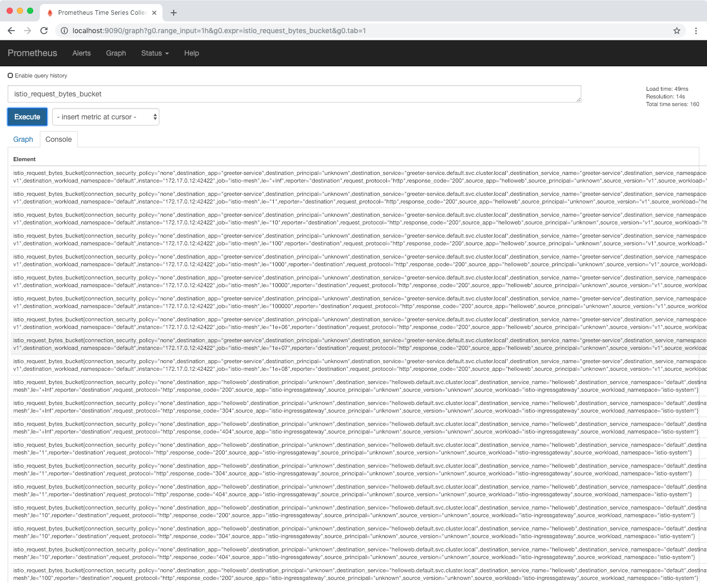

You can press CTRL+C in the terminal where you executed the `dashboard prometheus` command to close the tunnel. Just like you installed Prometheus, you also need to install Grafana with a similar command:

```sh
$ kubectl apply -f samples/addons/grafana.yaml
```

To open the Grafana dashboard use the command below:

```sh
istioctl dashboard grafana
```

The browser will automatically open at the Grafana's home page that looks similar to the figure below. 


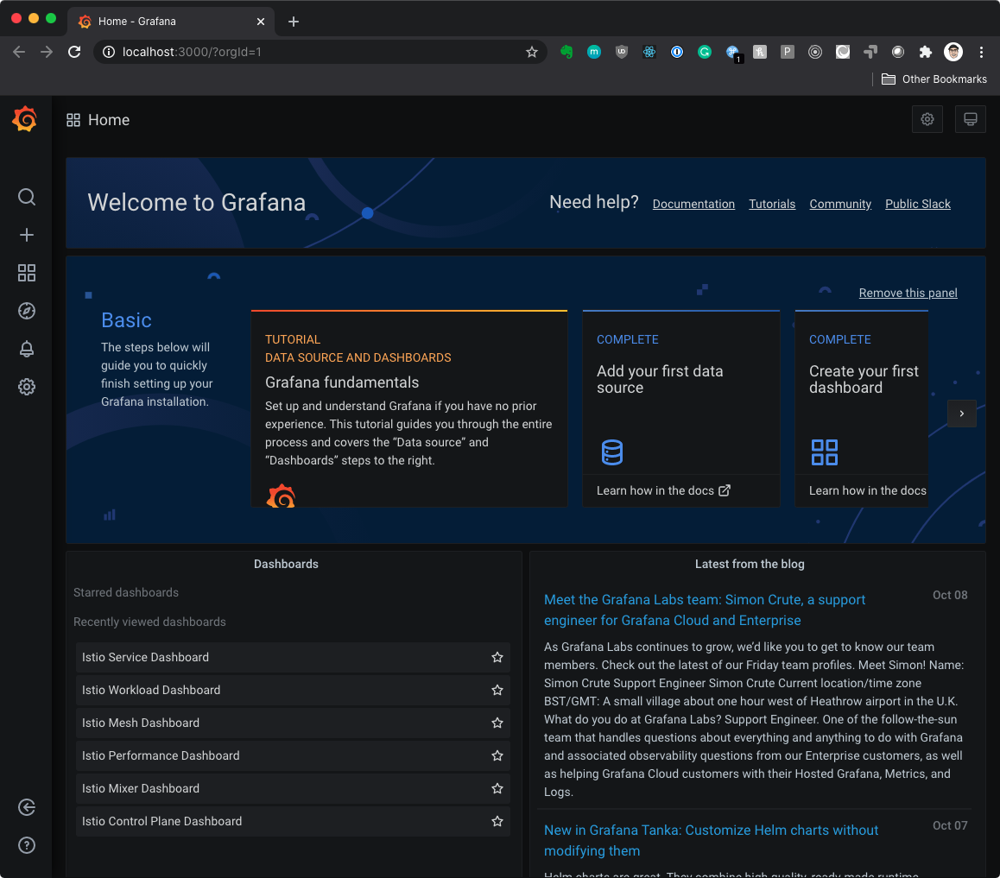

### Istio Dashboards

There are a couple of dashboards that Istio creates automatically on installation. The table below lists all the dashboards with their short descriptions.

| Dashboard Name                 | Description                                                  |
| ------------------------------ | ------------------------------------------------------------ |
| Istio Service Dashboard        | Shows detailed graphs and telemetry for each service running inside the mesh. You can use the drop-down at the top of the dashboard to select the service from the mesh. |
| Istio Workload Dashboard       | Shows detailed graphs and telemetry for service workloads.   |
| Istio Mesh Dashboard           | Shows an overview of the services inside the mesh, their latency, success rate, overall request volume and number of non-5xx, 4xx, 5xx HTTP responses. |
| Istio Performance Dashboard    | Shows the performance-related graphs for different Istio components (proxies, gateways, etc.) |
| Istio Mixer Dashboard          | Shows resource usage graphs for Istio mixer component and adapters. |
| Istio Control Plane  Dashboard | Shows resource usage graphs for Istio control plane.         |

Most of our time in this module will be spent in the Service and Workload dashboards to monitor the behavior of our services. Performance and per-component dashboards are more useful when you're running Istio in production and want to monitor and potentially alert on the components, their performance, and resource consumption.

## Service Mesh Observability with Kiali

[Kiali](https://www.kiali.io/) is a project that tries to answer what services are part of your service mesh and how are they connected. Since Istio features a configured using custom resources in Kubernetes, you can quickly see how hard and complicated it is to get an overview of your mesh, to see virtual services and routes, see the service graph, configuration, etc. It also integrates with Grafana and Jaeger, so you can use it as your starting dashboard for everything service mesh-related.

From the folder where you downloaded Istio, run the following command to install Kiali:

```sh
$ kubectl apply -f samples/addons/kiali.yaml
```

To open the Kiali dashboard, run `istioctl dashboard kiali`) command.

The browser will open automatically at the overview page, as shown in figure below.

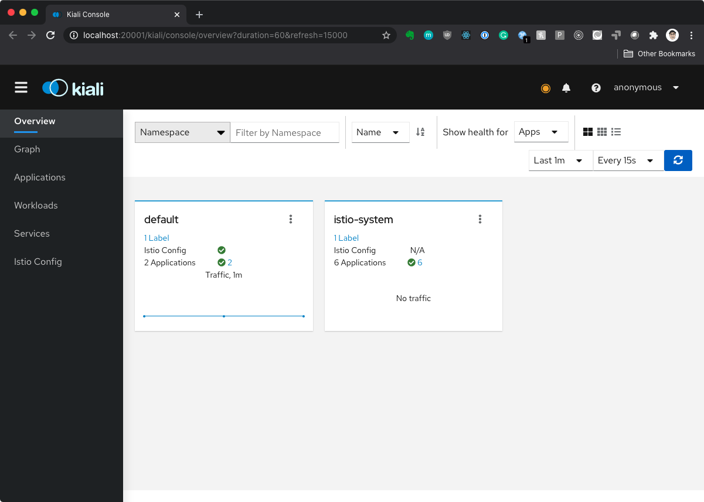

The overview page of Kiali shows you a list of namespaces and several applications running in each namespace. Using the links at the bottom of each namespace box or the sidebar on the left, you can look navigate through different views.

The first tab in the sidebar is called Graph that shows you all service within your mesh. Figure 4.4 shows the app graph - you can quickly see how different services are related to each other and how and where the calls are being made. The colors in the chart represent the health of the services. You will notice the lines between the ingress, helloweb and, greeter service are all green, which means that they are healthy. The gray color means no requests are being made to that particular service, while the nodes in red or orange may need attention.  

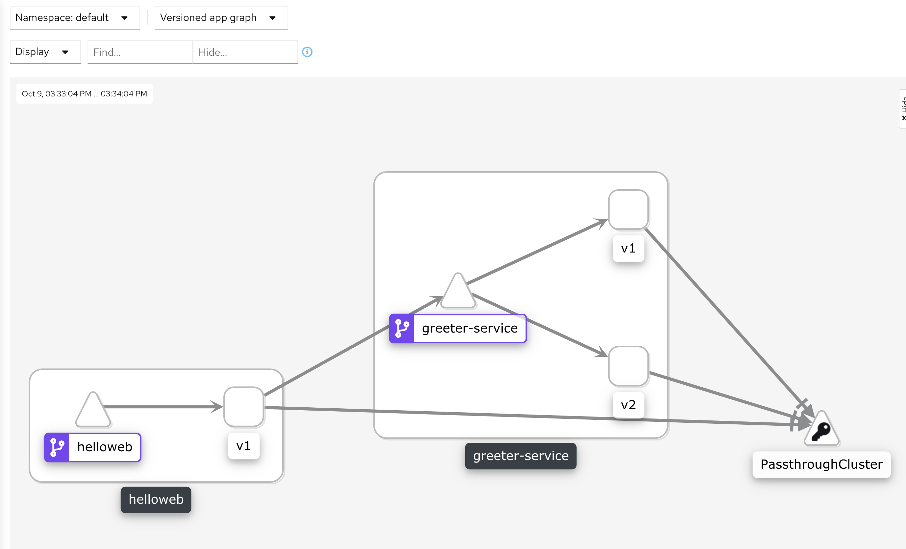

Under the display dropdown at the top, you can show or hide things such as virtual services, node names, service nodes, etc. Or turn on traffic animation - this will show how the requests are flowing through your services. Also, if you want to only focus on a specific component, you can double click on a graph node to look at that specific node as shown in figure below.

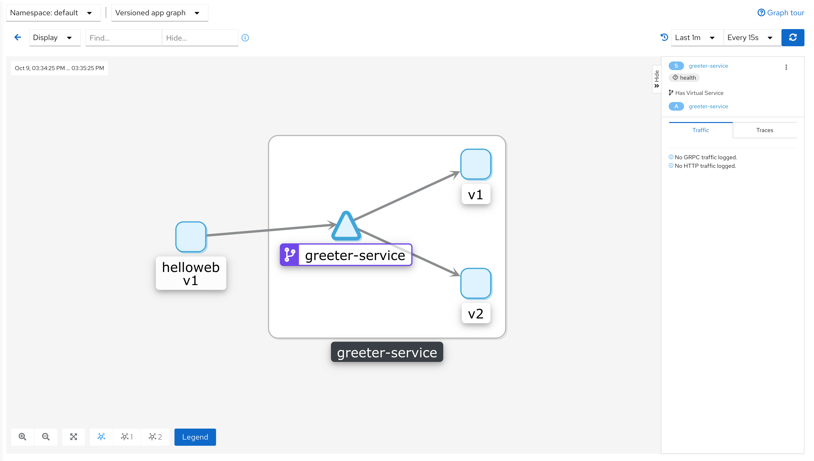

In the right-side panel, you will also notice the incoming and outgoing traffic as well as errors and requests.

The Applications, Workloads and Services tabs offer different views over things that are running inside the mesh, so we won't be digging deeper into those features.

An Istio specific feature is a tab called Istio Config. In this tab, you can get an overview of all Istio resources that are deployed in your mesh, such as gateways, virtual services, and destination rules. You can also get more details for each of the deployed resources by clicking on them. From the details page, you could see, for example, the traffic split or any potential configuration errors. For example, the figure below shows validation errors on the virtual service, because we forgot to deploy the destination rule, and the subsets are not recognized. If your traffic routes don't work, this is an excellent place to start and make sure your config is valid.

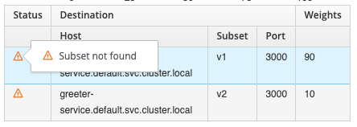

If you select **Services** and then click on a specific service, you will get an overview of that service. Additionally, you can use the Kiali UI to create matching or weighted routes, suspend traffic, or delete all traffic rules as shown in the figure below. Instead of figuring it out different options in the YAML file, you can pick and choose the conditions and apply them to desired routes.

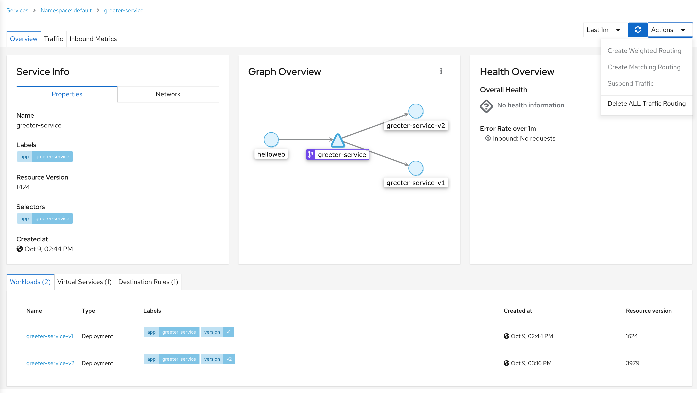

From the single service view, you can also use the Inbound Metrics and Traffic tabs to look through the metrics and traffic for that specific service. Each of those tabs also has a link to Grafana and Jaeger where you can further drill down into metrics and traces.  

## Distributed Tracing with Jaeger

Istio also installs [Jaeger](https://www.jaegertracing.io/). Jaeger is an open-source solution that offers end-to-end distributed tracing. We can easily monitor distributed transactions that are happening in our service mesh and discover any performance or latency issues. For our service to participate in this tracing, there are a couple of things we need to do. 

Let's start by installing Jaeger:

```sh
kubectl apply -f samples/addons/jaeger.yaml
```

Once Jaeger is install, you can open the dashboard:

```sh
istioctl dashboard jaeger
```

Your default browser will open the homepage for Jaeger that looks like one in the figure below: 

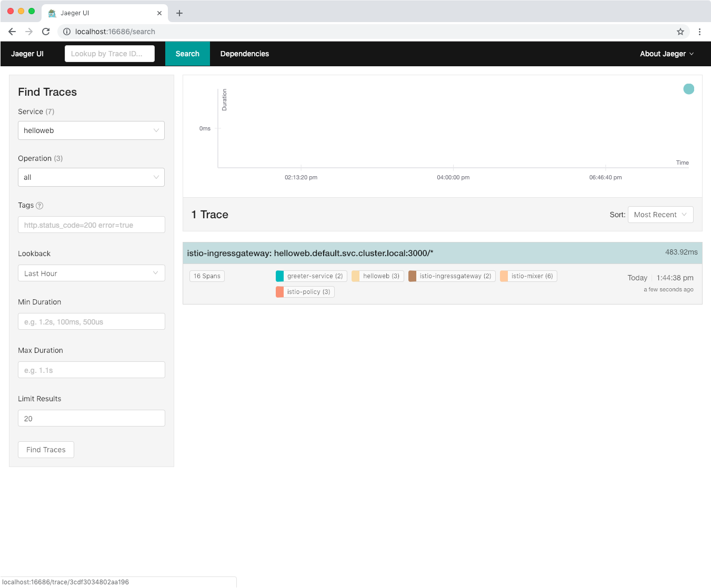

From the left bar on the homepage, you can pick a couple of things to filter down the traces, and once you get the list of traces, you can drill down into each specific trace to get more details of each trace. The figure below shows the detailed view of one of the traces.

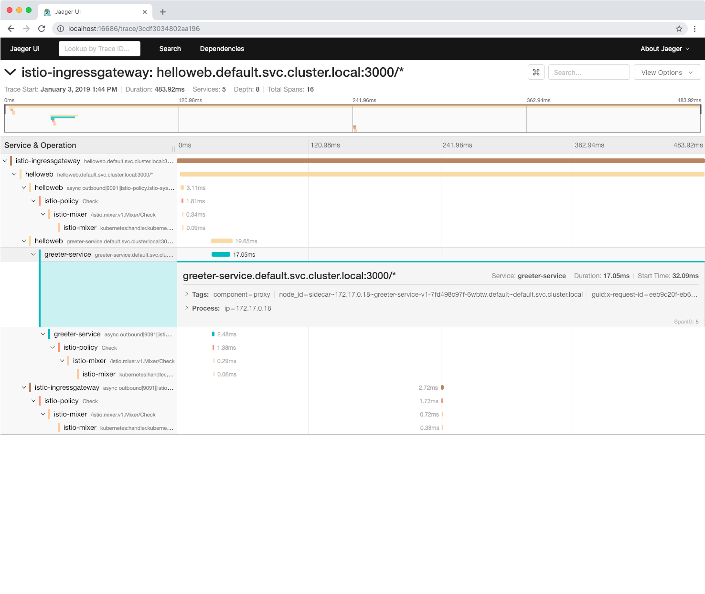

Each trace in Jaeger has a set of spans that correspond to services that were invoked when a request has been made. To trace details, Jaeger also shows how long each span took - for example, in the above figure, the call to the greeter service took 17.05ms.

You will also notice a bunch of other Istio related calls in the trace - such as a call to istio-policy and istio-mixer, etc.

To make our services traceable, we need to propagate HTTP headers each time we're doing calls to another service. In the Hello web service, we are making calls to the greeter service, so we need to ensure the following headers are retrieved from the incoming request and added to the outgoing request:

```sh
x-request-id
x-b3-traceid
x-b3-spanid
x-b3-parentspanid
x-b3-sampled
x-b3-flags
x-ot-span-context
```

Here's the code snippet from the Hello web source code that deals with these headers:

```go
function getFowardHeaders(req) {
    var headers = {};

    for (var i = 0; i < 7; i++) {
        var traceHeader = traceHeaders[i],
            value = req.get(traceHeader);

        if (value) {
            headers[traceHeader] = value;
        }
    }
    const useragent = req.get('user-agent');
    headers['user-agent'] = useragent;
    return headers;
}

const traceHeaders = [
    'x-request-id',
    'x-b3-traceid',
    'x-b3-spanid',
    'x-b3-parentspanid',
    'x-b3-sampled',
    'x-b3-flags',
    'x-ot-span-context',
];
```

The `getForwardHeaders` function is called whenever we are making requests to the downstream (greeter service) service: 

```go
const headers = getFowardHeaders(req);
...
axios.get(serviceUrl, { headers: headers, timeout: 5000 })
...
```

## Istio Resiliency Features

Istio gives you the ability to automatically set up timeouts, retries and circuit breakers, without touching or modifying your source code. This is a great feature you could use and ensure all your services are consistent. 

### Request Timeouts

Timeouts in Istio can be set in the virtual service resource using the `timeout` key. We are going to use a `v3` version of the greeter service - in this version of the service we have two endpoints: `/hello` and `/version`. The difference in this version is that the call to the `/version` endpoint takes an extra 2 seconds to return (we have a 2-second artificial delay in there). 

To demonstrate the timeouts (and later retries), we will set up the timeout on the `v3` greeter service to `0.5` seconds - that way, the request will timeout because of the 2-second delay we have hard-coded. 

Let's deploy the v3 version of the greeter service first:

```sh
kubectl create -f code/ch4/greeter-service-v3.yaml
```

And update the destination rule to include the `v3` subset, so the traffic can reach that version of the service:

```sh
cat <<EOF | kubectl apply -f - 
apiVersion: networking.istio.io/v1alpha3
kind: DestinationRule
metadata:
  name: greeter-service
spec:
  host: greeter-service.default.svc.cluster.local
  subsets:
    - name: v1
      labels:
        version: v1
    - name: v2
      labels:
        version: v2
    - name: v3
      labels:
        version: v3
EOF
```

Finally, let's update the virtual service and add a 0.5-second timeout for the greeter service `v3`:

```sh
cat <<EOF | kubectl apply -f -
apiVersion: networking.istio.io/v1alpha3
kind: VirtualService
metadata:
  name: greeter-service
spec:
  hosts:
    - greeter-service
  http:
    - route:
        - destination:
            host: greeter-service.default.svc.cluster.local
            port:
              number: 3000
            subset: v3
      timeout: 0.5s
EOF
```

Another small thing we need to do is update how we are calling the hello web. Note that the reason we are doing this is to be able to demonstrate different features and scenarios, without complicating or using different services. We are going to add a query `?separateRequest=true` to the helloweb request we are making. This will force the service to make two separate calls to the downstream greeter service - one to `/hello` endpoint and another one to `/version` endpoint (by default, helloweb makes one request to the `/hello` endpoint and extracts the greeting and version from there). 

Let's start making continuous calls to the helloweb like this:

```sh
while true; do sleep 1; curl -H "Host: helloweb.dev" http://$GATEWAY?separateRequest=true;done
```

Next, open the Grafana to see what's happening. Open the Istio Service dashboard and in the *Incoming Requests by Source and Response Code* graph, you will start seeing `504` response codes as shown in figure below - this is the gateway timeout response code.

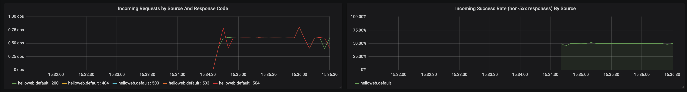

Another thing you can notice in the above graph is that the success rate is around `50%`. This is because helloweb is making two requests each time - one is failing with HTTP `504` and the other one (`/hello`) is succeeding. You can read a similar thing from the client success rate graph that's at ~50%. 

Open the Istio Workload Dashboard and select `helloweb` from the Workload dropdown. If you scroll down to the **Outbound Services** section you'll notice the *Outgoing Requests by Destination And Response Code* graphs that shows HTTP 504 and HTTP 200 responses for the greeter services. Similarly, the Outgoing Success Rate graph will show a 50% success rate as shown in figure below.

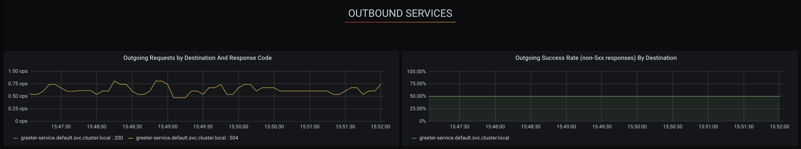

With all this data we know that something is wrong, but we can't tell what's happening. Let's dig deeper into Jaeger and search for the recent traces. Open Jaeger with `istioctl dash jaeger`. Select `helloweb.default` from the service dropdown and click **Find Traces**. You will notice that all traces have errors, as shown in figure below.

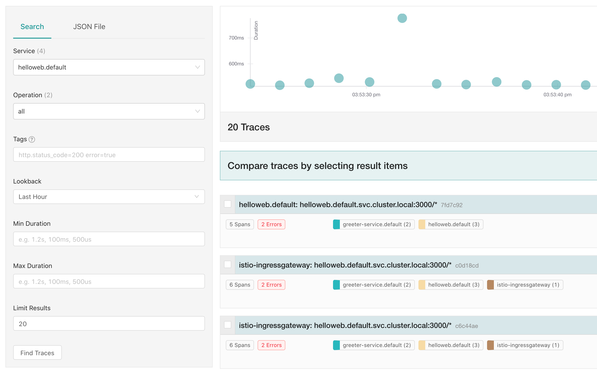

Let's click on one of those traces that has an error and see if we can get more information on what's going on. You can see two calls are being made to the greeter service - one has an error, and the other one doesn't. If you click on the greeter service that has an error and expand the tags, you can see the URL that's being called - `http://greeter-service:3000/version`. Another thing to note is the duration - it's always around 500 milliseconds, and this matches the timeout we set on the service.

### Request Retries

The second option we have that falls under the service resiliency is setting the request retries. We can configure the number of attempts and timeout per attempt we want to set when making calls to the service. To demonstrate retries, we will change the timeout to 2 seconds, and add three retries with a 0.5-second interval between each retry. This way we will be able to see the three retries being made that will eventually fail anyway (due to the 2-second timeout).

Let's deploy the modified virtual service first:

```sh
cat <<EOF | kubectl apply -f -
apiVersion: networking.istio.io/v1alpha3
kind: VirtualService
metadata:
  name: greeter-service
spec:
  hosts:
    - greeter-service
  http:
    - route:
      - destination:
          host: greeter-service.default.svc.cluster.local
          port:
              number: 3000
          subset: v3
      timeout: 2s
      retries:
        attempts: 3
        perTryTimeout: 0.5s
EOF
```

The effect of these changes is best observed in Jaeger - assuming you generated some traffic to the service, open the Jaeger dashboard, do a search for the last traces, and open the trace details. You should see something similar, as shown in the figure below.


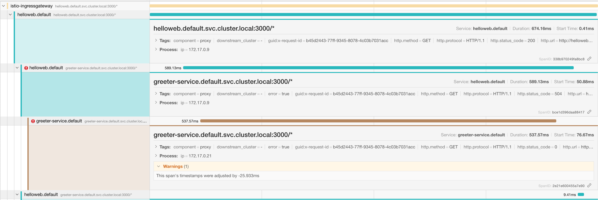

From the trace, it's evident that three requests were being made to the `/version` endpoint - you can expand the span and check the tags to see the endpoint. Jaeger also gives you the duration details, and it shows that each request was retried at a 0.5-second interval. The other thing you can find out from the trace is the timeout itself - if you look at the first helloweb span, it shows that the duration was 2 seconds - this is the same as the timeout you have set.

## Circuit Breakers

The last concept we will discuss is circuit breaking. Circuit breaking is an important pattern that can help with service resiliency. This pattern is used to prevent additional failures by controlling and managing access to the failing services. 

The easiest way to explain it is with a simple example. Let's say our greeter service starts failing and instead of call it continuously, we could detect the failures and either stop or reduce the number of calls being made to the service. If we added a database to this example, you could quickly imagine how calling the service could put more stress on different parts of the system and potentially make everything even worse. This is where a circuit breaker comes into play. We define the conditions when we want the circuit breaker to trip (for example, if we get more than 10 failures within a 5 second period), once circuit breaker trips, we won't be making calls to the underlying service anymore, instead, we will just directly return the error from the circuit breaker. This way, we are preventing additional strain and damage to the system.

In Istio, circuit breakers get defined in the destination rule. Circuit breaker tracks the status of each host, and if any of those hosts start to fail, it will eject it from the pool. Practically speaking, if we have five instances of our pod running, the circuit breaker will eject any of the instances that misbehave, so that the calls won't be made to those hosts anymore. Outlier detection can be configured by setting the following properties:

- number of consecutive errors 
- scan interval
- base ejection time

In addition to the outliers, we can also set the connection pool properties - such as the number of connections and requests per connection being made to the service.

Let's look at an example for the greeter service:

```yaml
apiVersion: networking.istio.io/v1alpha3
kind: DestinationRule
metadata:
    name: greeter-service
spec:
    host: greeter-service.default.svc.cluster.local
    trafficPolicy:
        connectionPool:
            http:
                http2MaxRequests: 10
                maxRequestsPerConnection: 5
        outlierDetection:
            consecutiveErrors: 3
            interval: 10s
            baseEjectionTime: 10m
            maxEjectionPercent: 10
    subsets:
        - labels:
              version: v1
          name: v1
        - labels:
              version: v2
          name: v2
```

The above rule sets the connection pool size to a maximum of 10 concurrent HTTP requests that have no more than five requests per connection to the greeter service. With the outlier detection properties, we are scanning the hosts every 10 seconds (default value), and if any of the hosts fails three consecutive times (default value is 5) with the 5xx error, we will remove the 10% of the failing hosts for 10 minutes.

Let's deploy the destination rule that configures a simple circuit breaker:

```sh
cat <<EOF | kubectl apply -f -
apiVersion: networking.istio.io/v1alpha3
kind: DestinationRule
metadata:
    name: greeter-service
spec:
    host: greeter-service
    trafficPolicy:
        connectionPool:
            http:
                http1MaxPendingRequests: 1
                maxRequestsPerConnection: 1
        outlierDetection:
            consecutiveErrors: 1
            interval: 1s
            baseEjectionTime: 2m
            maxEjectionPercent: 100
EOF
```

Let's also update the VirtualService and to remove the subsets and just route the traffic to the greeter service destination (no subsets):

```sh
cat <<EOF | kubectl apply -f -
apiVersion: networking.istio.io/v1alpha3
kind: VirtualService
metadata:
    name: greeter-service
spec:
    hosts:
        - greeter-service.default.svc.cluster.local
    http:
    - route:
      - destination:
          host: greeter-service.default.svc.cluster.local
          port:
            number: 3000
EOF
```

To demonstrate the circuit breaking, we will use the load-testing library called [Fortio](https://github.com/istio/fortio). With Fortio we can easily control the number of connection, concurrency, and delays of the outgoing HTTP calls. Let's deploy Fortio:

```sh
kubectl create -f code/ch4/fortio.yaml
```

To make  a simple call from the Fortio pod to the greeter service, run the following commands:

```sh
export FORTIO_POD=$(kubectl get pod | grep fortio | awk '{ print $1 }')
kubectl exec -it $FORTIO_POD  -c fortio -- fortio load -curl  http://greeter-service:3000/hello


HTTP/1.1 200 OK
x-powered-by: Express
content-type: application/json; charset=utf-8
content-length: 43
etag: W/"2b-DdO+hdtaORahq7JZ8niOkjoR0XQ"
date: Fri, 04 Jan 2019 00:53:19 GMT
x-envoy-upstream-service-time: 7
server: envoy

{"message":"hello 👋 ","version":"1.0.0"}
```

With the above command, we are just making one call to the greeter service, and it all works, we get the response back. Let's try to trip the circuit breaker now. To make the circuit breaker trip faster, we will decrease the number of replicas in our greeter service deployments from 3 to 1. 

```sh
kubectl scale deploy greeter-service-{v1,v2,v3} --replicas=1
```

Now we can use Fortio and make 20 requests with 2 concurrent connections:

```sh
kubectl exec -it $FORTIO_POD  -c fortio -- fortio load -c 2 -qps 0 -n 20 -loglevel Warning http://greeter-service:3000/hello
```

In the output, you will notice something similar to this:

```sh
Code 200 : 11 (55.0 %)
Code 503 : 9 (45.0 %)
```

This is telling us that 11 requests succeeded and 45% of them failed. Let's increase the number of concurrent connections to 3: 

```sh
kubectl exec -it $FORTIO_POD  -c fortio -- fortio load -c 3 -qps 0 -n 50 -loglevel Warning http://greeter-service:3000/hello
```

Now are getting more failures:

```sh
Code 200 : 19 (38.0 %)
Code 503 : 31 (62.0 %)
```

This is telling us that 38% of requests succeded, and the rest was caught by the circuit breaker. 
Another way to see the circuit breaking stats is in Prometheus. Run `istioctl dash prometheus` and execute the following query:

```sh
sum(istio_requests_total{destination_app="greeter-service"}) by (response_code, response_flags)
```

The results include all requests made to the `greeter-service` and they are grouped by the response code and response flags. The `UO` response flag next to the 503 responses stands for **u**pstream **o**verflow or circuit breaking.

## Conclusion

In this blog, you have learned about service resiliency and different strategies and patterns you can use to make your services more reliable. We talked a bit about Grafana and Jaeger and how you can use the graphs and traces to observe your services and see if and when something is going wrong.  We have also explained different resiliency concepts in Istio (timeouts and retries) you can use to make your service more resilient. Finally, we demonstrated how to create a simple circuit breaker to prevent unnecessary strain on the system in case of a failing service. 