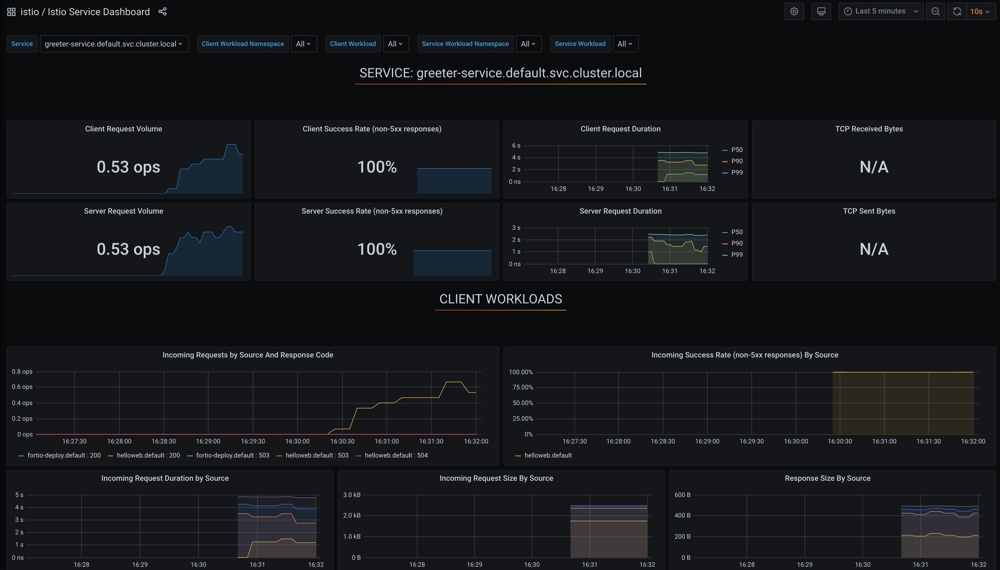
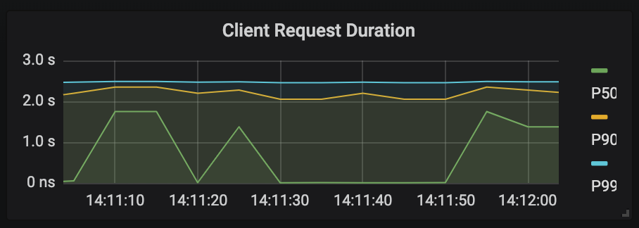
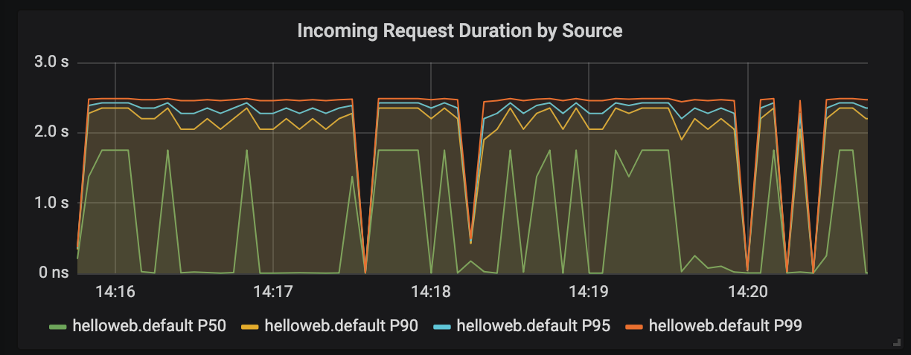
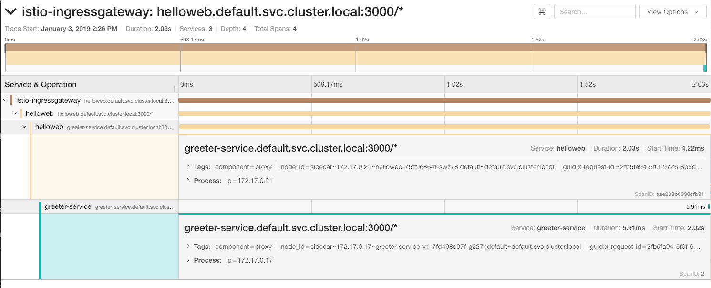
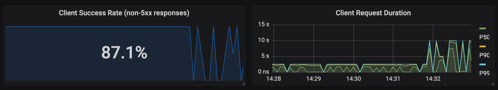
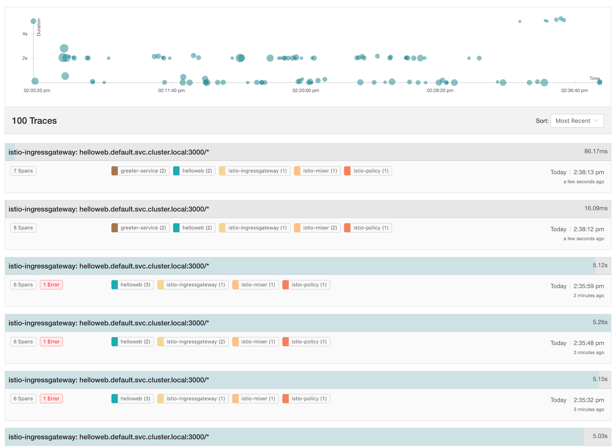
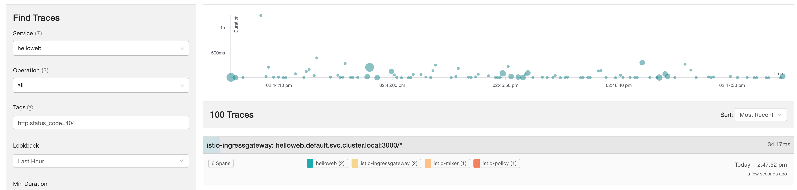

In this blog, we will talk about how to use Istio service mesh features that can help you to tests the resiliency of the services. 

## Making Services Fail

In the name of testing the service resiliency, you need a way to make your services fail and behave the way you want them to behave. Having the ability to make services fail is a great way to test them, discover how they behave in certain conditions and find any potential issues.

I've been writing all kinds of tests for a long time, and I have run into problems trying to make a service/component/application fail or behave in a certain way. Yes, there are mocks and fakes and other tools and practices available to help you with that, but it can still get complicated, especially if there are other dependencies in play. For example, if I want to make service A respond with a specific error, then I also need to make sure the database read fails and the call to service B fails, etc. If you've never run into this - consider yourself lucky.

With Istio, you can inject certain types of failures into the requests. Faults that get defined in the `VirtualService` are injected, while the HTTP request is being forwarded to the destination route. Two different types of faults that can be injected. **HTTP delays** inject a user-specified delay before forwarding the request to the destination route. This type of failure is used to simulate different network issues, such as service taking too long to respond due to load. The second service resiliency testing feature is the ability to inject **HTTP aborts**. This allows you to specify a specific HTTP code that you return to calling service. Using the aborts, you can simulate a broken service or a service returning different responses. For example, you can test how the calling service behaves if the underlying call returns an HTTP 404 or HTTP 500 code.

## Injecting HTTP Delays

Let's start with an example of an HTTP delay. In the VirtualService below, we are injecting a **two seconds** delay for **50%** of all requests that are being sent to the greeter service:

```sh
cat <<EOF | kubectl apply -f -
apiVersion: networking.istio.io/v1alpha3
kind: VirtualService
metadata:
    name: greeter-service
spec:
    hosts:
        - greeter-service
    http:
        - route:
              - destination:
                    host: greeter-service.default.svc.cluster.local
                    port:
                        number: 3000
          fault:
              delay:
                  percent: 50
                  fixedDelay: 2s
EOF
```

Once you deploy this, you can start making calls to the Hello web and observe the dashboards in Grafana. To quickly generate some traffic, you can use the snippet below - this command runs `curl` every 1 second:

```sh
while true; do sleep 1; curl -H "Host: helloweb.dev" http://$GATEWAY;done
```

### Observing Delays in Grafana

With the above command running, open the Istio Service Dashboard in Grafana, and from the **Service** drop-down, select `greeter-service.default.svc.cluster.local` as this is the service we injected delays in. You should already see the graphs getting populated with data. Here's how the Istio Service Dashboard looks like after a couple of minutes: 



You can also observe the injected delay from other graphs listed below. 

**Client Request Duration**

This graph shows the client request duration in `p50`, `p90` and `p99`. Looking at the `p99` it's telling us that 99% of the calls took less than  ~2.4 seconds and 1% of calls took longer than 2.4 seconds. Similarly, if you look at the `p50`, you can see that at certain times 50% of the calls took less than ~1.3 seconds and the other 50% of the calls took longer. 



**Incoming Request Duration by Source**

Just like the Client Request Duration graph, you can see the latency coming from the upstream service (`helloweb`). If there were multiple versions of the upstream service, it would be very clear from this graph which version is slower and which one is faster. 



Other graphs on this page are telling you that there were no failures - the client success rate graph is at 100%. Similarly, the Incoming requests by source and response code graph only show HTTP 200 responses.

If you switch the service selection to the `helloweb.default.svc.cluster.local` from the service drop-down on the dashboard, you should see similar graphs, and it is reasonably evident that there is a two-second delay happening.

### Observing Delays in Jaeger

How about traces in Jaeger? Let's open the Jaeger dashboard and do a quick search for all traces that have a minimum duration of 2 seconds:

1. Open the Jaeger dashboard using the `istioctl dashboard` command:

```
istioctl dashboard jaeger
```

1. From the **Service** drop-down, select the `helloweb.default` service
1. Type `2s` in the **Min Duration** text box
1. Click the **Find Traces** button

Depending on how long you've been making requests, you should see a bunch of traces (note that these are only the traces that took at least 2 seconds). Let's click on one of them and take a closer look.



It's very clear from these traces how long the call took - the total request duration from `helloweb` to `greeter-service` took 2.03 seconds. The `greeter-service` took only 5.9 ms to respond.

### Discovering issues

The combination of Grafana dashboards, Jaeger traces, and HTTP delays is a powerful tool that can help you discover potential issues with your services. Let's show an example of how you could find a potential problem.

 We are going to cheat a bit though - in the implementation of the Hello web we set the timeout when making calls to the downstream service to 5 seconds. So, if we'd inject an HTTP delay of 6 seconds we could see how the timeouts are manifested in the graphs. Start by deploying the following `VirtualService`:

```sh
cat <<EOF | kubectl apply -f -
apiVersion: networking.istio.io/v1alpha3
kind: VirtualService
metadata:
    name: greeter-service
spec:
    hosts:
        - greeter-service
    http:
        - route:
              - destination:
                    host: greeter-service.default.svc.cluster.local
                    port:
                        number: 3000
          fault:
              delay:
                  percent: 50
                  fixedDelay: 6s
EOF
```

If you are following along and looking at the Grafana dashboard (you can the dashboard with `istioctl dash grafana`), you'll quickly see that success rate starts to drop and the client request duration starts increasing as shown in the figure below:



Likewise, you can see that in addition to the HTTP 200 responses, the incoming requests graph shows a bunch of HTTP 500 responses as well. This is a clear indication that something is going wrong. Let's peek at the Jaeger dashboard and look at all traces for the `helloweb` service. 



Now you can see errors in some of the traces (notice the `1 Error` label on the left side). Another interesting thing to note is the duration - since you set a fixed delay to 6 seconds, one would expect to see duration around that number. However, notice how the duration is only slightly above 5 seconds, but not even close to 6 seconds. What that means is that request was failing even before the 6-second delay passed, hence the error in the trace. Remember the "cheat" we mentioned - we have a 5-second timeout set; since service is taking 6 seconds to respond (due to the injected delay), the whole request times-out before that.

## Injecting HTTP Aborts

As mentioned earlier, you can also randomly inject HTTP aborts into your services, to help you tease out any issues. The syntax for injecting aborts is very similar to the one you've seen earleier. Instead of using the `delay` key, you are going to use `abort` key and define the HTTP status you want to return from the service:

```sh
cat <<EOF | kubectl apply -f -
apiVersion: networking.istio.io/v1alpha3
kind: VirtualService
metadata:
  name: greeter-service
spec:
  hosts:
    - greeter-service
  http:
    - route:
        - destination:
            host: greeter-service.default.svc.cluster.local
            port:
              number: 3000
      fault:
        abort:
          percentage:
            value: 50
          httpStatus: 404
EOF
```

The above snippet applied to the `greeter-service` is going to make the service return an HTTP 404, for 50% of all the incoming requests. The effect of the injected aborts can be observed in the same graphs as the delays. Here's how the Incoming Requests by Source and Response Code graph looks like: 


It is clear from the above graph how we went from having some HTTP 500 responses (because of the timeout that was injected earlier) to having zero HTTP 500 response. On the right side of the graph, you can see an increasing number of HTTP 404 responses (yellow line), which is due to the abort we injected.

Looking at Jaeger, you can search by setting the tag text box value to `http.status_code=404`. This returns all traces that contain the HTTP 404 status. Note how these traces only contain `helloweb` and no traces from the `greeter-service` - this is expected because the requests never reach the `greeter-service` as the sidecar proxy intercepts the call and returns an HTTP 404.



## Advanced Scenarios

Now that you understand how basic fault injection works, you can get fancier and start combining both HTTP delays and HTTP faults. You could easily deploy something like this:

```sh
cat <<EOF | kubectl apply -f -
apiVersion: networking.istio.io/v1alpha3
kind: VirtualService
metadata:
  name: greeter-service
spec:
  hosts:
    - greeter-service
  http:
    - route:
        - destination:
            host: greeter-service.default.svc.cluster.local
            port:
              number: 3000
      fault:
        abort:
          percentage:
            value: 10
          httpStatus: 404
        delay:
          percentage:
            value: 10
          fixedDelay: 6s
EOF
```

With the above VirtualService, you are injecting HTTP 404 aborts for 10% of the incoming requests in addition to a 6-second delay for 10% of the incoming requests. If you go even further and combine what you've learned in the traffic management blog, you could write a VirtualService that looks like this: 

```sh
cat <<EOF | kubectl apply -f -
apiVersion: networking.istio.io/v1alpha3
kind: VirtualService
metadata:
  name: greeter-service
spec:
  hosts:
    - greeter-service
  http:
    - fault:
        abort:
          percentage:
            value: 10
          httpStatus: 404
      match:
        - headers:
            user-agent:
              regex: '.*Firefox.*'
      route:
        - destination:
            host: greeter-service.default.svc.cluster.local
            port:
              number: 3000
    - route:
        - destination:
            host: greeter-service.default.svc.cluster.local
            port:
              number: 3000
EOF
```

This virtual service injects HTTP 404 responses for 10% of the incoming requests that are coming from the Firefox browser. Similarly, you could insert a delay if you wanted to, or get even more advanced with using different service versions and injecting failures to only specific versions of the service. 

As you see, there's a lot of possibilities here. For example, you could write your chaos monkey tool that runs inside your cluster and randomly injects faults and delays in your services. Doing this is a great way to make sure your services won't fall over and are resilient as well as ensuring you have all monitoring and observability in place that will allow you to notice these things once you're in production.

## Conclusion

This blog demonstrated how you could use Istio service mesh features to test how resilient your services are. Additionally, in combination with Grafana and Jaeger, you can quickly spot when or if something goes wrong with your services.

