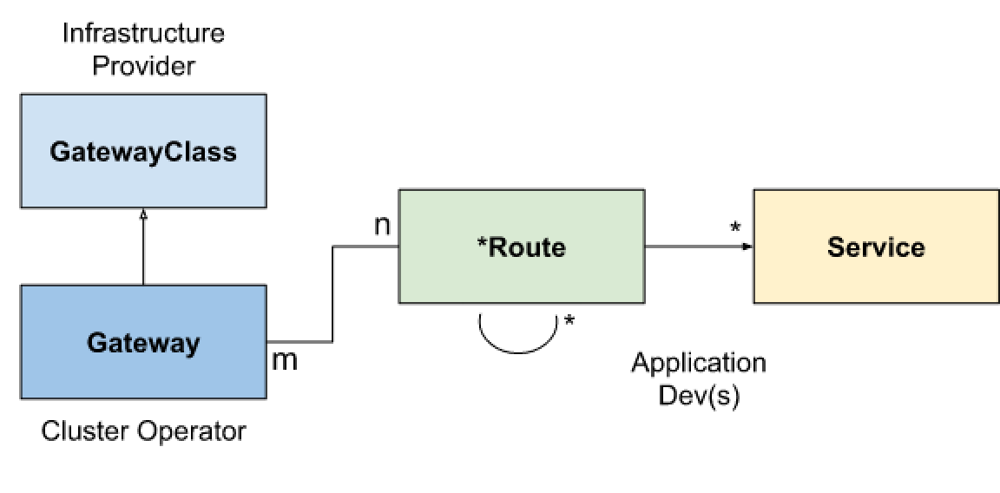

On February 9, Istio announced the release of [Istio 1.9](https://istio.io/latest/news/releases/1.9.x/announcing-1.9/). In this release, we can see the wider adoption of VMs into the service mesh, and even better VM support, cert issuance to VMs, and health checking for the workload entry. Istio’s latest releases, 1.7 and 1.8, made a lot of progress toward making VMs first-class workloads in the mesh, and cert issuance has been the final gap to close.

## Onboarding VMs in the Service Mesh

Virtual machine integration is one of the [core features](https://istio.io/latest/about/feature-stages/) of Istio, and in this release it is upgraded to beta, which means it is available for production and is no longer a toy. 

Running Kubernetes workloads in an Istio mesh has been a given for quite some time and so has been running VM workloads for the past couple of Istio releases. This latest release of Istio makes it even easier to mix Kubernetes and VM workloads in a service mesh. 

Common use cases include running applications on VMs in a datacenter or VMs in a cloud environment. These VMs either run legacy or third party applications/services. Some of these applications/services won’t be going away any time soon-- or in some cases, ever! Some of these VM workloads are part of an application modernization journey including the move to microservices or RESTful services deployed as distributed services, some of them running in containers. In the course of this application modernization journey, some of these VMs run monolithic workloads until they are broken down into microservices: running these applications in VMs provides a path to the target RESTful services or APIs and makes for a smoother transition.

With such an incremental approach you can start onboarding existing applications running in VMs to the service mesh. Then, as you build out your service mesh practices, you can gradually decompose those monolithic applications to services and more easily deploy them across multiple clusters, clouds, and hybrid environments. Istio can help with this using `WorkloadEntry`, `WorkloadSelector` and `WorkloadGroup` to manage VMs in the mesh to facilitate a more assured transition in your application modernization journey. 

## Aligning with the Kubernetes Service API

With the Kubernetes Service API, infrastructure providers and platform operators can set up multiple Controllers for different purposes. Thus it decouples Gateway from Envoy, which facilitates the use of different reverse-proxy backends in Istio.

Istio has been actively working with [Kubernetes SIG-NETWORK group](https://github.com/kubernetes/community/tree/master/sig-network) since version 1.6, using the [Kubernetes Service API](https://kubernetes-sigs.github.io/service-apis/) to replace the existing Gateway declaration and expose services in the mesh to the outside. Previously, you needed to create a VirtualService to bind to the Gateway in order to expose the service outside of the mesh. Now you can use GatewayClass, Gateway, and Route. GatewayClass defines a set of Gateways that share a common configuration and behavior. This is similar to [IngressClass](https://github.com/kubernetes/enhancements/blob/master/keps/sig-network/20190125-ingress-api-group.md#ingress-class) for Ingress and [StorageClass](https://kubernetes.io/docs/concepts/storage/storage-classes/) for PersistentVolumes. Route is similar to the Route configuration in [VirtualService](https://istio.io/latest/docs/reference/config/networking/virtual-service/). You can try this feature by referring to the [Istio documentation](https://istio.io/latest/docs/tasks/traffic-management/ingress/service-apis/), but note that this feature is still in the experimental stage.

## Summary

Istio 1.9 makes the status of each feature clearer, which also helps to increase user confidence in using them. After the last few major changes, I believe that Istio's API will become more stable in further development.

Extending the service mesh to VMs has been an important part of Tetrate’s founding mission. Tetrate offers Istio support and a premium, Istio-based service mesh management platform built for multi-cluster, multitenancy, and multi-cloud. 

#### Resources:

- Istio 1.9 Release: https://istio.io/latest/news/releases/1.9.x/announcing-1.9/
- Tetrate Service Bridge: [www.tetrate.io/tetrate-service-bridge](https://www.tetrate.io/tetrate-service-bridge)
- GetIstio, Tetrate’s tested, open source Istio distro: [www.getistio.io](https://www.getistio.io)
- [Contact Tetrate](http://www.tetrate.io/contact-us) for more information.

