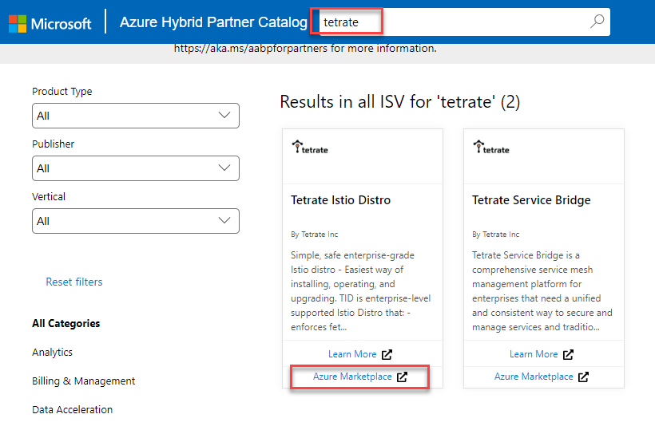
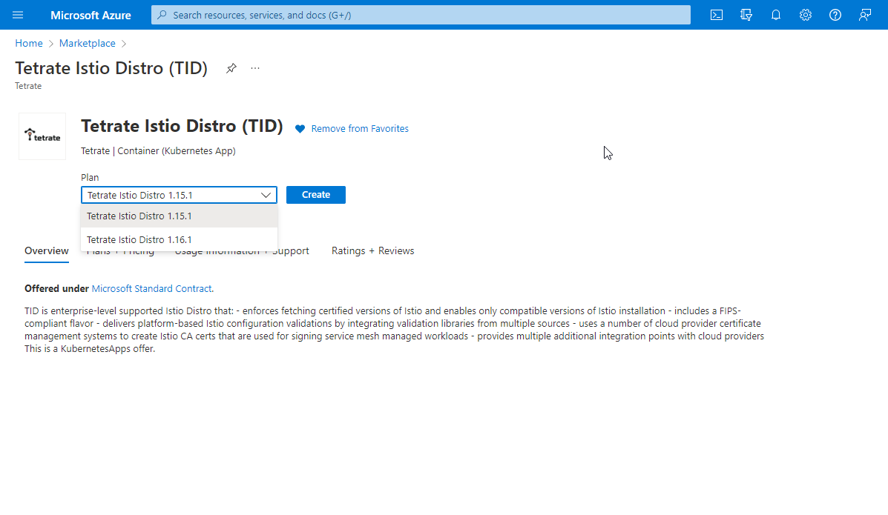
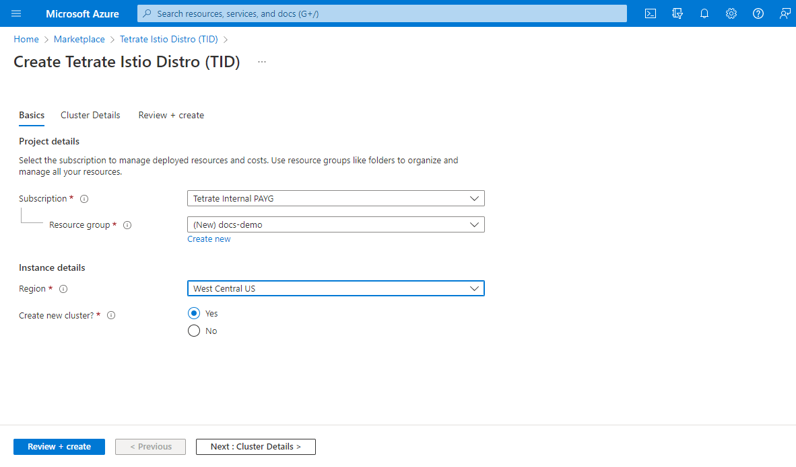
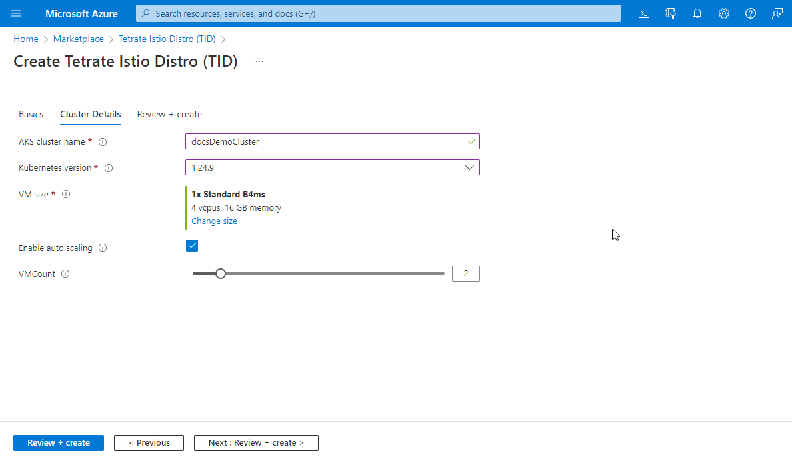
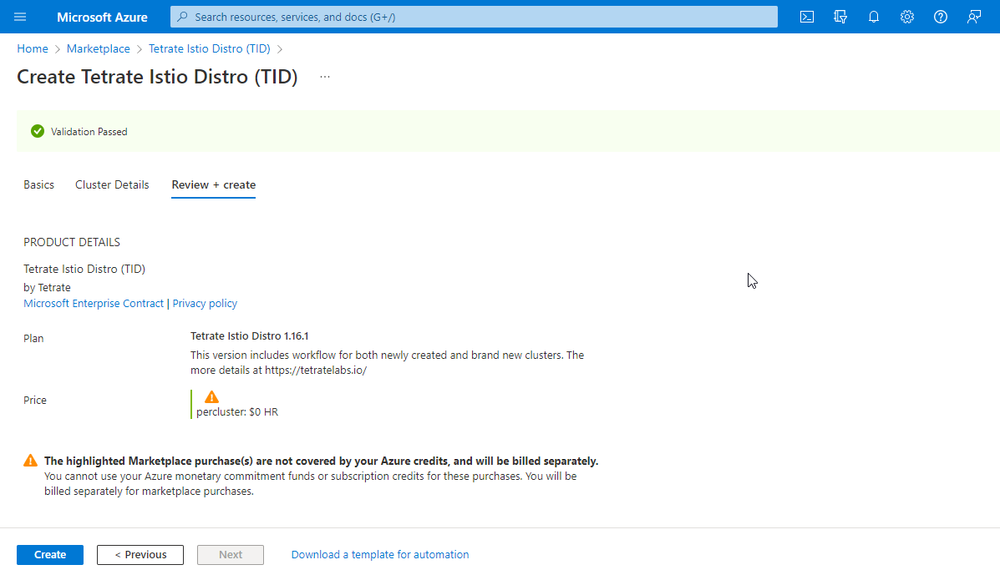
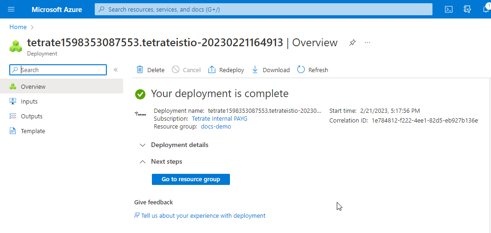

Azure Container Marketplace also the deployment of Tetrate Istio Distro (TID) on existing AKS clusters, or allows to create Azure AKS cluster with pre-installed TID. (TID is also listed in [Azure Stack HCI Catalog](https://azurehybridpartner.com/isv) as tested and validated Solution).

- Start by selecting the [Tetrate Istio Distro](https://azuremarketplace.microsoft.com/en-us/marketplace/apps/tetrate1598353087553.tetrateistio?tab=Overview) offer on the Azure Marketplace.

- Then choose a plan (the list is constantly changing as newer versions are released):

- Select between existing cluster and a new cluster creation. Enter the basic info on the first page per figure below:

- Select AKS cluster name and Kubernetes version, also the cluster attributes:

- Let Azure to validate your settings and proceed with cluster creation:

- After the cluster is created, you can begin provisioning your application and Istio will automatically onboard and connect your services:

When the cluster Deployment is completed - you can proceed with deploying applications in Istio-enabled AKS cluster.
