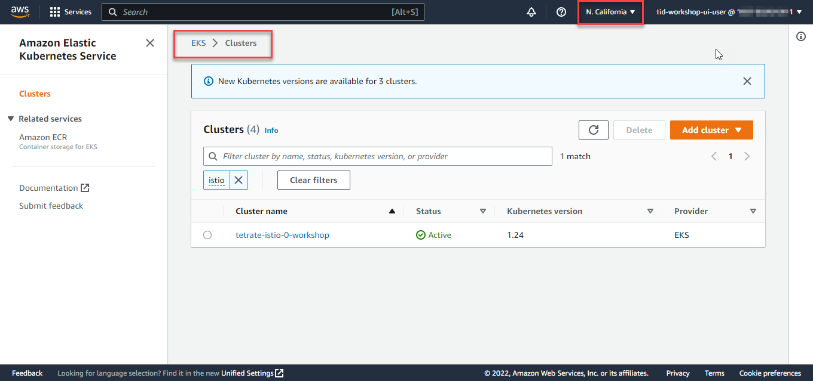
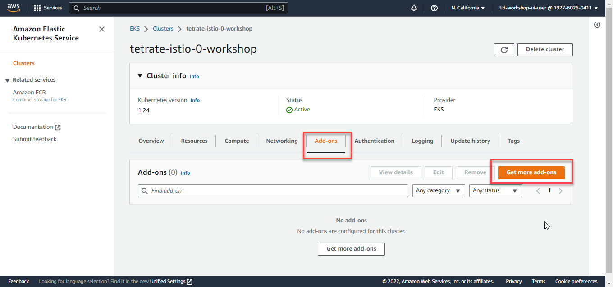
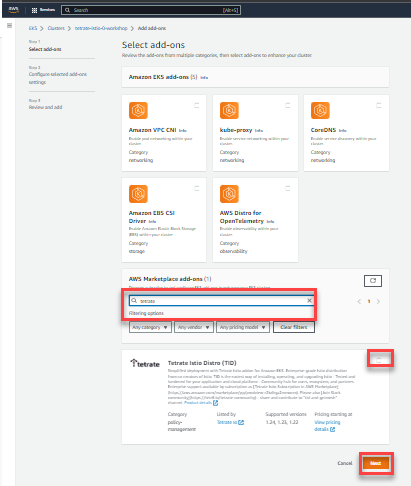
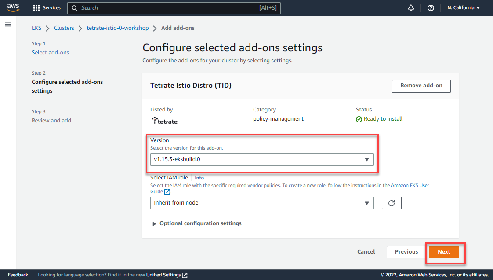
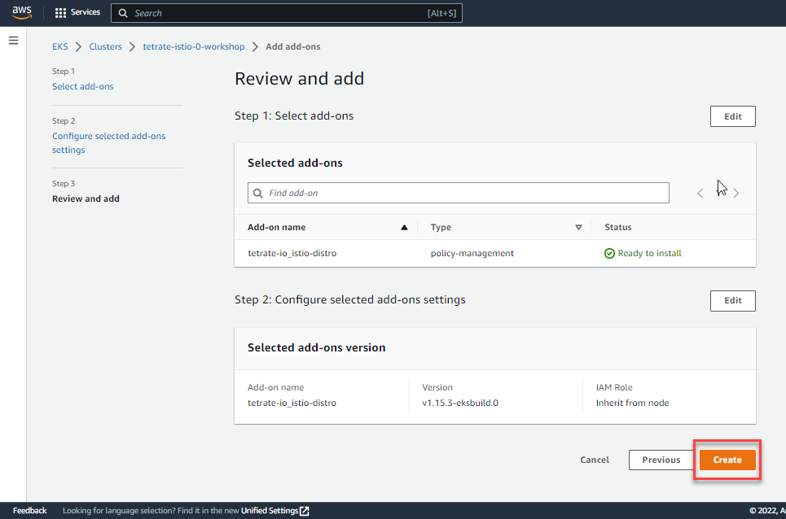
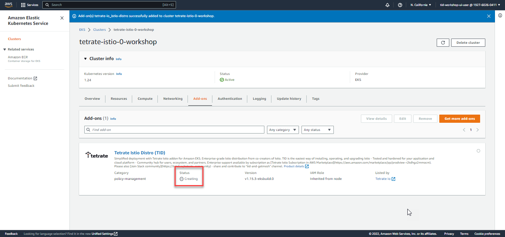
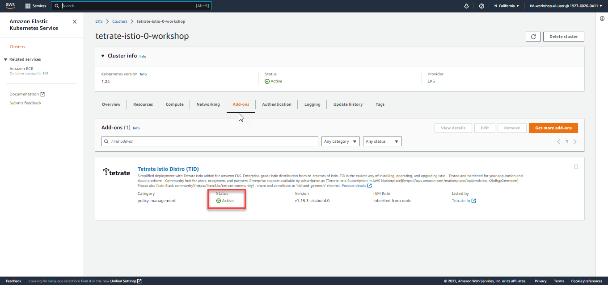

AWS and Tetrate have brought ability to deploy Istio to EKS cluster with minimal number of steps. TID EKS add-on deployment can be done via AWS Web console or AWS CLI. Below are both approaches are described.

### Installing TID addon via AWS Web Console

- Proceed to EKS section of AWS Web Console and locate your cluster:

- Select **Add-ons** tab and select **Get more add-ons**

- Scroll down to **AWS Marketplace add-ons** section of add-ons
    - type `Tetrate` in the search bar
    - select checkmark in the right top corner and click **Next**

- on the next screen confirm the TID version and click **Next**

- **Review and add** screen to make sure the selection is correct

- You're taken back to the cluster add-on tab and can see that the add-on is being created

- After waiting for 90 seconds and UI refresh you can see that the add-on is deployed successfully


### Installing TID addon via the command line

- Check that add-on is available (the AWS Marketplace subscription is required before for TID addon to be deployed in AWS account)

    ```sh
    aws eks describe-addon-versions --addon-name tetrate-io_istio-distro 
    ```

- Deploy TID add-on to the cluster in AWS EKS

    ```sh
    aws eks create-addon --addon-name tetrate-io_istio-distro --cluster-name <CLUSTER_NAME>
    ```

- The installation will take around 2 minutes. To get the current state use the following command. 

    ```sh
    aws eks describe-addon --addon-name tetrate-io_istio-distro --cluster-name <CLUSTER_NAME>
    ```

When the add-on is in Active state - you can proceed with deploying applications in Istio-enabled EKS cluster.
