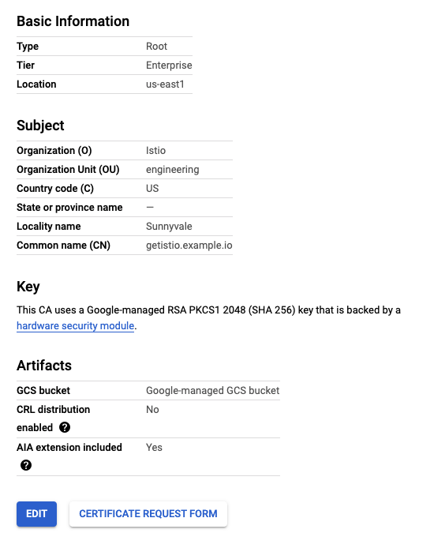
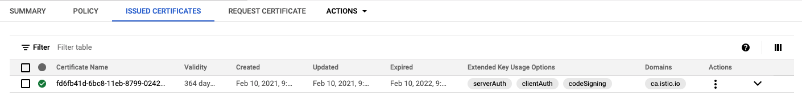

Instead of using a self-signed root certificate, here we get an intermediary Istio certificate authority (CA) from GCP CAS (Certificate Authority Service) to sign the workload certificates.

This approach enables the same root of trust for the root CA's workloads in GCP CAS. As Istio signs the workload certs, the latency for getting workload certs issued is far less than directly getting the certs signed by ACM Private CA itself.

The [`getistio gen-ca`](/getistio-cli/reference/getistio_gen-ca) command furnishes the options to connect to ACM Private CA and get the intermediary CA cert signed. It uses the certificate details thus obtained to create the **cacerts** Kubernetes secret for Istio to use to sign workload certs. Istio, at startup, checks for the presence of the secret **cacerts** to decide if it needs to use this cert for signing workload certificates.

## Prerequisites

To follow this tutorial, you will need a Google Cloud Platform account and a Kubernetes cluster with Istio installed and the following:

- A CA set up in GCP CAS
- GCP credentials file and the environment variable `GOOGLE_APPLICATION_CREDENTIALS` pointed to the crednetials to get the CSR with CA set signed by the GCP CAS. Refer to the [Getting started with authentication](https://cloud.google.com/docs/authentication/getting-started) documentation on how to setup the GCP credentials.

You can follow the [prerequisites](/istio-in-practice/prerequisites) for instructions on how to install and setup Istio.

<details>
<summary><strong>Click here, if you need to set up GCP CA</strong></summary>

### Setting up CAS

The first thing we need is to set up the CAS in Google Cloud Console. Log in to your Google Cloud account and follow the steps below to create a CAS instance.

1. From the navigation menu, select Security → Certificate Authority Service.
1. Click the **Create CA** button.
1. Configure the CA type:
    1. Select **Root CA**.
    1. Select **365 days** for validity.
    1. Select the **Enterprise** tier.
    1. Select the CAS's location from the **Location** list (e.g. `us-east1`).
    1. Click **Next**.
1. Configure the CA subject name (you can use your values here):
    1. For **Organization (O)**, enter **Istio**.
    1. For **Organization unit (OU)**, enter **engineering**.
    1. For **Country name (C)**, enter **US**.
    1. For **Locality name**, enter **Sunnyvale**.
    1. For **CA Common name (CN)**, enter **getistio.example.io**.
    1. For **Resource ID**, enter **getistio-example-io**.
    1. Click **Next**.
1. Configure the CA key size and algorithm:
    1. Select **RSA PKCS1 2048 (SHA 256)**.
    1. Click **Next**.
1. Click the **Create** button to create the CAS.

The figure below shows the summary page. Note that your page might look different if you configured your own CA subject name.



### Configure GCP credentials

Ensure you have GCP credentials set up (e.g.`GOOGLE_APPLICATION_CREDENTIALS` environment variable has to point to the credentials) on a machine you're accessing the Kubernetes cluster from. Alternatively, if you installed GetIstio on Google Cloud Shell, the credentials are already set up.
</details>

## Creating CAS configuration

We will use a YAML configuration to configure CAS and CSR creation. Use the YAML below as a template, and enter the CAS information from the CAS summary page on GCP:
 
```yaml
providerName: "gcp"
providerConfig:
  gcp:
    # This will hold the full CA name for the certificate authority you created on GCP
    casCAName: "projects/tetrate-io-istio/locations/us-west1/certificateAuthorities/getistio-example-com"

certificateParameters:
  secretOptions:
    istioCANamespace: "istio-system" # namespace where `cacerts` secrets live
    force: true # force delete the `cacerts` secret and replace it with this new one
  caOptions:
    validityDays: 365 # validity days before the CA expires
    keyLength: 2048 # length (bits) of Key to be created
    certSigningRequestParams: # x509.CertificateRequest; most fields omitted
      subject:
        commonname: "getistio.example.io"
        country: 
          - "US"
        locality:
          - "Sunnyvale"
        organization:
          - "Istio"
        organizationunit:
          - "engineering"
      emailaddresses:
        - "youremail@example.io"
```

Save the above file to `gcp-cas-config.yaml` and use `gen-ca` command to create the `cacert`:

```sh
getistio gen-ca --config-file gcp-cas-config.yaml
```

The command output should look similar to this:

```text
Kubernetes Secret YAML created successfully in /home/user/.getistio/secret/getistio-740905469.yaml
Kubernetes Secret created successfully with name: cacerts, in namespace: istio-system
```

Before continuing, make sure to delete the `istiod` Pod in the `istio-system` namespace to force it to use the created `cacerts`.

### Try it out

If you've labeled the `default` namespace for automatic sidecar injection (see [Prerequisites](/istio-in-practice/prerequisites)), we can then deploy a sample Hello world application:

```sh
kubectl create deploy helloworld --image=gcr.io/tetratelabs/hello-world:1.0.0
```

Wait for the Pod to start and then get the certificate chain and CA root certificate proxies use for mTLS. We will save them in the `proxy_secret` file:

```sh
getistio istioctl pc secret [pod-name] -o json > proxy_secret
```

The CA root certificate is base64 encoded in the `trustedCA` field. For example:

```text {hl_lines=[11]}
...
{
            "name": "ROOTCA",
            "versionInfo": "2021-02-09 04:11:42.776876959 +0000 UTC m=+0.407526692",
            "lastUpdated": "2021-02-09T04:11:42.783Z",
            "secret": {
                "@type": "type.googleapis.com/envoy.extensions.transport_sockets.tls.v3.Secret",
                "name": "ROOTCA",
                "validationContext": {
                    "trustedCa": {
                        "inlineBytes": "<base64 encoded value>"
                    }
                }
            }
```

Store the decoded value to the `encodedCA.crt` file and then use `openssl` to decrypt the certificate into a more readable form:

```sh
openssl x509 -text -noout -in  encodedCA.crt
```

The output will include the common name, organization and other values we set in the CAS:

```text {hl_lines=[7,11]}
Certificate:
    Data:
        Version: 3 (0x2)
        Serial Number:
            55:7f:b3:00:f8:b2:24:50:dc:51:7c:e5:85:5a:14:7a:65:28:26:38
        Signature Algorithm: sha256WithRSAEncryption
        Issuer: C = US, L = Sunnyvale, O = Istio, OU = engineering, CN = getistio.example.io
        Validity
            Not Before: Feb 10 17:24:51 2021 GMT
            Not After : Feb 10 17:24:51 2022 GMT
        Subject: C = US, L = Sunnyvale, O = Istio, OU = engineering, CN = getistio.example.io
        Subject Public Key Info:
            Public Key Algorithm: rsaEncryption
                RSA Public-Key: (2048 bit)
...
```

Similarly, if you go to CAS instance in Google Cloud Console, you'll notice the issued certificate under **Issued Certificates** tab, as shown in the figure below. Notice the `ca.istio.io` domain.


