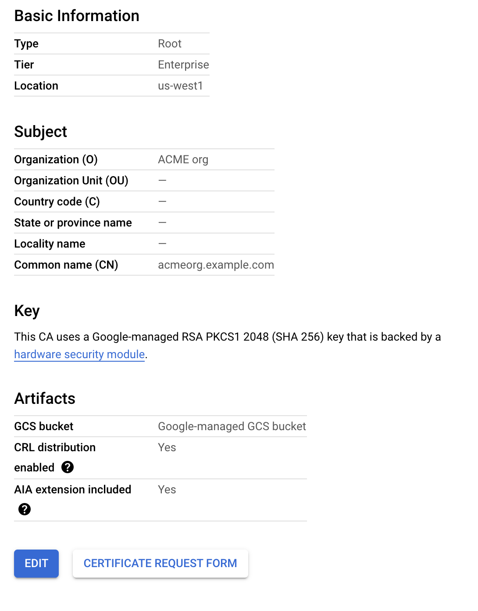
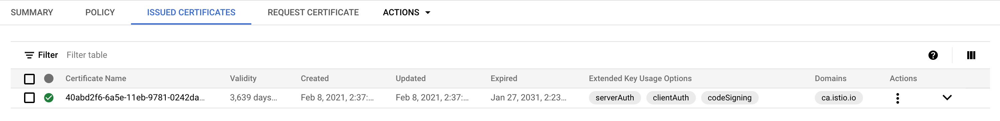

Using GetIstio you can connect to Google Cloud Platform's Certificate Authority Service (CAS) and get the intermediary CA certs signed.

## Prerequisites

To follow this tutorial, you will need a Google Cloud Platform account and a Kubernetes cluster with Istio installed.

You can follow the [prerequisites](/istio-in-practice/prerequisites) for instructions on how to install and setup Istio.

### Setting up CAS

The first thing we need is to set up the CAS in Google Cloud Console. Log in to your Google Cloud account and follow the steps below to create a CAS instance.

1. From the navigation menu, select Security → Certificate Authority Service.
1. Click the **Create CA** button.
1. Configure the CA type:
    1. Select the CAS's location from the **Location** list (e.g. `us-east1`).
    1. Click **Next**.
1. Configure the CA subject name (you can use your values here):
    1. For **Organization (O)**, enter **ACME org**.
    1. You can skip the Organization unit, Country name, State, and Locality name, as they are optional.
    1. For **CA Common name (CN)**, enter **acmeorg.example.com**.
    1. For **Resource ID**, enter **acmeorg-example-com**.
    1. Click **Next**.
1. Configure the CA key size and algorithm:
    1. Select **RSA PKCS1 2048 (SHA 256)**.
    1. Click **Next**.
1. Click the **Create** button to create the CAS.

The figure below shows the summary page. Note that your page might look different if you configured your own CA subject name.



### Configure GCP credentials

Ensure you have GCP credentials set up (e.g.`GOOGLE_APPLICATION_CREDENTIALS` environment variable has to point to the credentials) on a machine you're accessing the Kubernetes cluster from. Alternatively, if you installed GetIstio on Google Cloud Shell, the credentials are already set up.

## Creating CAS configuration

We will use a YAML configuration to configure CAS and CSR creation. Use the YAML below as a template, and enter the CAS information from the CAS summary page on GCP:
 
```yaml
providerName: "gcp"
providerConfig:
  gcp:
    # Replace with the resource name of the certificate authority you created on GCP
    # You can get the resource name by selecting the View option in the Actions menu on GCP
    casCAName: "projects/tetrate-io-istio/locations/us-west1/certificateAuthorities/acmeorg-example-com"

certificateParameters:
  secretOptions:
    # Namespace where 'cacerts' Kubernetes secret is created on your target cluster
    istioCANamespace: "istio-system"
    # SecretFilePath is the file path used to store the Kubernetes Secret in yaml format
    secretFilePath:
    # Force flag when enabled forcefully deletes the `cacerts` secret
    # in istioNamespace, and creates a new one.
    force: true
  caOptions:
    # ValidityDays represents the number of validity days before the CA expires.
    # Replace with the value selected during CAS creation
    validityDays: 3640
    # KeyLength is the length(bits) of Key to be created
    keyLength: 2048
    # This is x509.CertificateRequest. Only a few fields are shown below
    certSigningRequestParams:
      subject:
        commonname: "acmeorg.example.com"
        organization:
          - "ACME org"
        # You can also enter any optional fields if you defined them in CAS
        # organizationunit:
        #   - "engineering"
        # country:
        #   - "US"
        # locality:
        #   - "Sunnyvale"
      emailaddresses:
        - "hello@example.com"
```

Save the above file to `gcp-cas-config.yaml` and use `gen-ca` command to create the `cacert`:

```sh
getistio gen-ca --config-file gcp-cas-config.yaml
```

The command output should look similar to this:

```text
Kubernetes Secret YAML created successfully in /home/user/.getistio/secret/getistio-740905469.yaml
Kubernetes Secret created successfully with name: cacerts, in namespace: istio-system
```

Before continuing, make sure to delete the `istiod` Pod in the `istio-system` namespace to force it to use the created `cacerts`.

### Try it out

If you've labeled the `default` namespace for automatic sidecar injection (see [Prerequisites](/istio-in-practice/prerequisites)), we can then deploy a sample Hello world application:

```sh
kubectl create deploy helloworld --image=gcr.io/tetratelabs/hello-world:1.0.0
```

Wait for the Pod to start and then get the certificate chain and CA root certificate proxies use for mTLS. We will save them in the `proxy_secret` file:

```sh
getistio istioctl pc secret [pod-name] -o json > proxy_secret
```

The CA root certificate is base64 encoded in the `trustedCA` field. For example:

```text {hl_lines=[11]}
...
{
            "name": "ROOTCA",
            "versionInfo": "2021-02-09 04:11:42.776876959 +0000 UTC m=+0.407526692",
            "lastUpdated": "2021-02-09T04:11:42.783Z",
            "secret": {
                "@type": "type.googleapis.com/envoy.extensions.transport_sockets.tls.v3.Secret",
                "name": "ROOTCA",
                "validationContext": {
                    "trustedCa": {
                        "inlineBytes": "<base64 encoded value>"
                    }
                }
            }
```

Store the decoded value to the `encodedCA.crt` file and then use `openssl` to decrypt the certificate into a more readable form:

```sh
openssl x509 -text -noout -in  encodedCA.crt
```

The output will include the common name, organization and other values we set in the CAS:

```text {hl_lines=[7,11]}
Certificate:
    Data:
        Version: 3 (0x2)
        Serial Number:
            a6:fd:46:64:ce:8b:21:28:6f:4b:98:7c:1c:8e:dd:88
    Signature Algorithm: sha256WithRSAEncryption
        Issuer: O=ACME org, CN=acmeorg.example.com
        Validity
            Not Before: Feb  9 01:41:56 2021 GMT
            Not After : Feb  9 02:41:56 2022 GMT
        Subject: O=ACME org, CN=acmeorg.example.com
        Subject Public Key Info:
            Public Key Algorithm: rsaEncryption
                Public-Key: (2048 bit)
...
```

Similarly, if you go to CAS instance in Google Cloud Console, you'll notice the issued certificate under **Issued Certificates** tab, as shown in the figure below. Notice the `ca.istio.io` domain.

