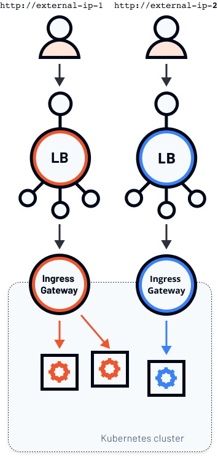

When installing Istio, you have an option to pick the installation configuration profile to use. There are six installation profiles in the latest Istio release: default, demo, minimal, remote, empty, and preview.

Each of the profiles contains a different combination of components. For example, if you pick the minimal profile, you will only install `istiod`. No egress or ingress gateways will be installed. On the other hand, if we use the demo profile, Istio installs both ingress and egress gateway, in addition to `istiod`.

 You can read more about the configuration profiles and check components that are part of the profiles on [Istio's docs page](https://istio.io/latest/docs/setup/additional-setup/config-profiles/).

Using [GetIstio](https://getistio.io) you can pass in the installation configuration profile name to install Istio. For example, to install the demo profile, you can run this command:

```sh
getistio istioctl install --set profile=demo
```

You can additionally customize your Istio installation, regardless of the profile, by passing additional  `--set <key>=<value>` key/value pairs to the command. 

## Why multiple gateways?

Now before you go and create multiple ingress gateways (and multiple load balancers with your cloud provider), make sure you need it. Load balancers cost money, and it's yet another thing you need to manage. A single load balancer can work well with a lot of scenarios, however there are cases where you might have one private or internal load balancer and a second public one.

The scenario with a single load balancer would look like the figure below.


We have a single ingress gateway - a Kubernetes service with LoadBalancer type and a Pod running Envoy. The fact that the service is of LoadBalancer type causes creating an actual load balancer instance and gives us an external IP address.

With the Istio Gateway resource, the **host** key in the configuration and attaching a Gateway to a VirtualService, we can expose multiple different services from the cluster on different domain names or sub-domains. 

Now consider a different scenario where you want two separate load balancer instances running - shown in the figure below.



In this scenario, we have two different external IPs that point to two different ingress gateways that run inside the same Kubernetes cluster. Let's look at how to achieve this.

## Configuring Gateways

To get started, we need to look at the Istio configuration for a single ingress gateway that gets deployed when you use the default (or demo/preview profile). We can use the `profile dump` command to get the configuration:

```sh
getistio istioctl profile dump --config-path components.ingressGateways > ingress-gateway.yaml
```

>If you see a message saying `proto: tag has too few fields: "-"`, you can safely ignore it. This is a [known issue](https://github.com/istio/istio/issues/26751) that's being currently worked on.

Here's how the contents of the `ingress-gateway.yaml` file look like:

```yaml
- enabled: true
  k8s:
    env:
    - name: ISTIO_META_ROUTER_MODE
      value: standard
    hpaSpec:
      maxReplicas: 5
      metrics:
      - resource:
          name: cpu
          targetAverageUtilization: 80
        type: Resource
      minReplicas: 1
      scaleTargetRef:
        apiVersion: apps/v1
        kind: Deployment
        name: istio-ingressgateway
    resources:
      limits:
        cpu: 2000m
        memory: 1024Mi
      requests:
        cpu: 100m
        memory: 128Mi
    service:
      ports:
      - name: status-port
        port: 15021
        protocol: TCP
        targetPort: 15021
      - name: http2
        port: 80
        protocol: TCP
        targetPort: 8080
      - name: https
        port: 443
        protocol: TCP
        targetPort: 8443
      - name: tcp-istiod
        port: 15012
        protocol: TCP
        targetPort: 15012
      - name: tls
        port: 15443
        protocol: TCP
        targetPort: 15443
    strategy:
      rollingUpdate:
        maxSurge: 100%
        maxUnavailable: 25%
  name: istio-ingressgateway
```

The settings defined above are for the default Istio ingress gateway. The YAML includes the HorizontalPodAutoscaler configuration (`hpaSpec`), resource limits and requests (`resources`), service ports (`ports`), deployment strategy (`strategy`), and environment variables (`env`).

When installing Istio, we can define one or more Gateways directly in the IstioOperator resource. Here's an example of an Istio operator that deploys a single (default) ingress gateway:

```yaml
apiVersion: install.istio.io/v1alpha1
kind: IstioOperator
spec:
  components:
    ingressGateways:
      - name: istio-ingressgateway
        enabled: true
```

To deploy a second ingress gateway, we can add an entry under `ingressGateways` field. For example, let's add a second gateway called `istio-ingressgateway-staging` in the namespace `staging`:

```yaml
apiVersion: install.istio.io/v1alpha1
kind: IstioOperator
spec:
  components:
    ingressGateways:
      - name: istio-ingressgateway
        enabled: true
      - name: istio-ingressgateway-staging
        namespace: staging
        enabled: true
```

Before we go and deploy this, we also need to modify the labels this new Gateway will use. Remember, if we don't specify anything, Istio uses the default Gateway configuration, and we will end up with two Gateways with the same labels, albeit in a different namespace.

The IstioOperator allows us to add new or modify existing labels by merely setting the `label` field. Here's how the updated IstioOperator looks like:

```yaml
apiVersion: install.istio.io/v1alpha1
kind: IstioOperator
spec:
  components:
    ingressGateways:
      - name: istio-ingressgateway
        enabled: true
      - name: istio-ingressgateway-staging
        namespace: staging
        enabled: true
        label:
            istio: istio-ingressgateway-staging
```

This YAML ensures that the label `istio: istio-ingressgateway-staging` is applied to all resource Istio creates for the ingress gateway. Before we install the operator, we need to create the `staging` namespace first:

```sh
kubectl create ns staging
```

Now we're ready to install Istio. Save the above YAML to `istio-2-gw.yaml` and use `getistio` to install it:

```sh
$ getistio istioctl install -f istio-2-gw.yaml
This will install the Istio default profile with ["Istio core" "Istiod" "Ingress gateways"] components into the cluster. Proceed? (y/N) y
✔ Istio core installed
✔ Istiod installed
✔ Ingress gateways installed
✔ Installation complete
```

When the installation completes, you can list the Pods and Services in the `staging` namespace:

```sh
$ kubectl get po,svc -n staging
NAME                                               READY   STATUS    RESTARTS   AGE
pod/istio-ingressgateway-staging-8b59464d7-fvlhx   1/1     Running   0          5m30s

NAME                                   TYPE           CLUSTER-IP     EXTERNAL-IP     PORT(S)                                                      AGE
service/istio-ingressgateway-staging   LoadBalancer   10.96.13.200   XX.XXX.XXX.XX   15021:31259/TCP,80:31104/TCP,443:31853/TCP,15443:31053/TCP   5m29s
``` 

You'll notice a running `istio-ingressgateway-staging` Pod and a `istio-ingressgateway-staging` service of the type LoadBalancer and with an external IP that's different from the default ingress gateway that's running in the `istio-system` namespace.

### Testing multiple Istio Gateways

Time to test the gateways! Make sure you have labeled the `default` namespace with `istio-injection=enabled` (see [Prerequisites](./prerequisites)) and then use the snippet below to create a Service, Deployment, Gateway, and a VirtualService.

```sh
cat << EOF | kubectl apply -f -
apiVersion: v1
kind: Service
metadata:
  name: nginx
  namespace: default
  labels:
    app: nginx
spec:
  ports:
  - port: 80
    name: http
  selector:
    app: nginx
---
apiVersion: apps/v1
kind: Deployment
metadata:
  name: nginx
  namespace: default
  labels:
    app: nginx
spec:
  replicas: 1
  selector:
    matchLabels:
      app: nginx
  template:
    metadata:
      labels:
        app: nginx
    spec:
      containers:
      - name: nginx
        image: nginx:alpine
        imagePullPolicy: IfNotPresent
        ports:
        - containerPort: 80
---
apiVersion: networking.istio.io/v1alpha3
kind: Gateway
metadata:
  name: gateway
  namespace: default
spec:
  selector:
    istio: ingressgateway
  servers:
  - port:
      number: 80
      name: http
      protocol: HTTP
    hosts:
    - '*'
---
apiVersion: networking.istio.io/v1alpha3
kind: VirtualService
metadata:
  name: nginx-1
  namespace: default
spec:
  hosts:
  - "*"
  gateways:
  - gateway
  http:
  - route:
    - destination:
        host: nginx
        port:
          number: 80
EOF
```

Wait for the Pod to start, and open the first ingress gateway IP address in your browser. You can use this command to get the IP address:

```sh
kubectl get svc istio-ingressgateway -n istio-system  -o jsonpath='{.status.loadBalancer.ingress[0].ip}'
``` 

You should get back the default "Welcome to nginx!" page. Let's see what happens if we try to open the external IP of the second ingress gateway we deployed. You can use a similar command as above to get the IP address by updating the service name and namespace:

```sh
kubectl get svc istio-ingressgateway-staging -n staging  -o jsonpath='{.status.loadBalancer.ingress[0].ip}'
```

You won't be able to connect to the staging ingress gateway, and this is expected. We haven't deployed any Gateway resources that would configure the ingress. Let's update the label value to `istio-ingressgateway-staging` and re-deploy the Gateway resource:

```sh {hl_lines=[9]}
cat <<EOF | kubectl apply -f -
apiVersion: networking.istio.io/v1alpha3
kind: Gateway
metadata:
  name: gateway
  namespace: default
spec:
  selector:
    istio: istio-ingressgateway-staging
  servers:
  - port:
      number: 80
      name: http
      protocol: HTTP
    hosts:
    - '*'
EOF
```

This time, you should access the Nginx home page through the staging gateway, while the original gateway won't point to anything. 

At this point, you could create a separate Gateway resource to control both ingress gateways independently. 