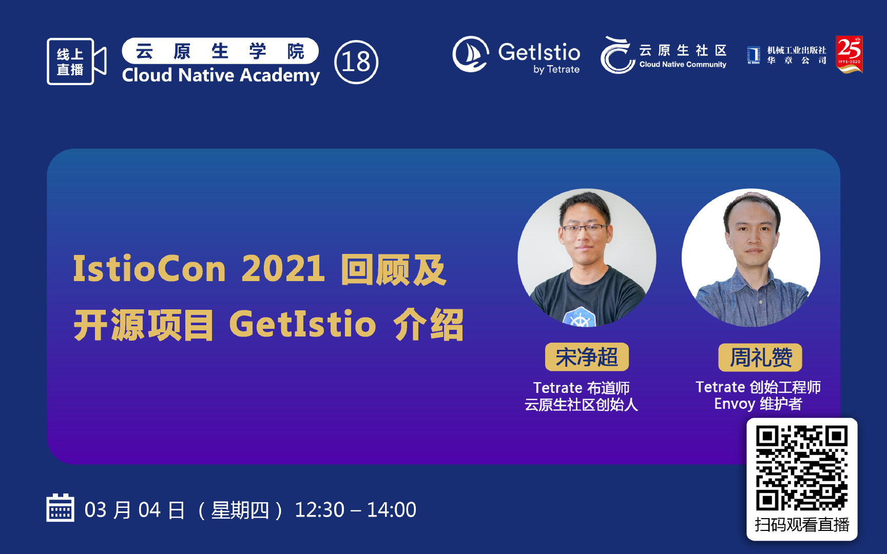



GetMesh 社区首届 meetup 将作为[云原生学院](https://i.cloudnative.to/academy/)第 18 期直播的特别活动，在 Bilibili 直播。

- 主持人：厉辉
- 嘉宾：宋净超（Tetrate 布道师/云原生社区创始人）、周礼赞（Tetrate 创始工程师/Envoy 维护者）
- 直播间：<https://live.bilibili.com/22230973>
- 会议纪要：[腾讯文档](https://docs.qq.com/doc/DYVBSVG1pTVlHdVhv)

## 议题

1. IstioCon 2021 回顾
2. Istio 2021 Roadmap
3. Tetrate 开源项目 GetIstio 及 GetEnvoy 介绍
4. Istio 第三轮官网中文翻译志愿者招募
5. Istio 学习资源分享

## 听众收获

2 月底首届 IstioCon 刚刚结束，通过本次直播你会了解到 Istio 社区的一些动向，还有企业级服务网格公司 Tetrate 新开源的项目 GetIstio 及已开源的 GetEnvoy，还有云原生社区 Istio SIG 的活动。



