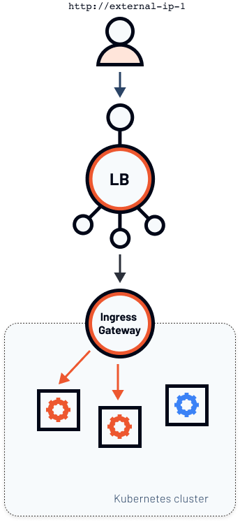

安装 Istio 时，可以选择要使用的安装配置文件。最新的 Istio 版本中有六个安装配置文件：default、demo、minimal、remote、empty 和 preview。

每个配置文件包含不同的组件组合。例如，如果您选择最小配置文件，则只会安装`istiod`。不会安装出口或入口网关。另一方面，如果使用演示配置文件，则 Istio 会同时安装入口和出口网关`istiod`。

您可以在[Istio 的 docs 页面](https://istio.io/latest/docs/setup/additional-setup/config-profiles/)上阅读有关配置配置文件的更多信息，并检查属于配置文件的组件。

使用 [GetIstio](/) 您可以传入安装配置文件名称来安装 Istio。例如，要安装演示配置文件，可以运行以下命令：

```sh
getmesh istioctl install --set profile=demo
```

您还可以通过将其他`--set <key>=<value>`键 / 值对传递给命令来自定义 Istio 安装，而不考虑配置文件 。

## 为什么要使用多个网关？

现在，在您创建多个入口网关（以及您的云提供商使用多个负载均衡器）之前，请确保您需要它。负载平衡器需要花钱，这是您需要管理的另一件事。单个负载均衡器可以在很多情况下很好地工作，但是在某些情况下，您可能有一个私有或内部负载均衡器，而又有一个公共负载均衡器。

具有单个负载均衡器的方案如下图所示。



在这种情况下，我们有两个不同的外部 IP，它们指向在同一 Kubernetes 集群中运行的两个不同的入口网关。让我们看看如何实现这一目标。

## 配置网关

首先，我们需要查看单个 Ingress 网关的 Istio 配置，当您使用默认网关（或演示 / 预览配置文件）时将对其进行部署。我们可以使用以下`profile dump`命令获取配置：

```sh
getmesh istioctl profile dump --config-path components.ingressGateways > ingress-gateway.yaml
```

> 如果您看到一条消息，说`proto: tag has too few fields: "-"`您可以放心地忽略它。这是当前正在解决的[已知问题](https://github.com/istio/istio/issues/26751)。

`ingress-gateway.yaml`文件内容如下所示：


在这种情况下，我们有两个不同的外部 IP，它们指向在同一 Kubernetes 集群中运行的两个不同的入口网关。让我们看看如何实现这一目标。

## 配置网关

首先，我们需要查看单个 Ingress 网关的 Istio 配置，当您使用默认网关（或演示 / 预览配置文件）时将对其进行部署。我们可以使用以下`profile dump`命令获取配置：

```sh
getmesh istioctl profile dump --config-path components.ingressGateways > ingress-gateway.yaml
```

> 如果您看到一条消息，说`proto: tag has too few fields: "-"`您可以放心地忽略它。这是当前正在解决的[已知问题](https://github.com/istio/istio/issues/26751)。

`ingress-gateway.yaml`文件内容如下所示：

```yaml
- enabled: true
  k8s:
    env:
    - name: ISTIO_META_ROUTER_MODE
      value: standard
    hpaSpec:
      maxReplicas: 5
      metrics:
      - resource:
          name: cpu
          targetAverageUtilization: 80
        type: Resource
      minReplicas: 1
      scaleTargetRef:
        apiVersion: apps/v1
        kind: Deployment
        name: istio-ingressgateway
    resources:
      limits:
        cpu: 2000m
        memory: 1024Mi
      requests:
        cpu: 100m
        memory: 128Mi
    service:
      ports:
      - name: status-port
        port: 15021
        protocol: TCP
        targetPort: 15021
      - name: http2
        port: 80
        protocol: TCP
        targetPort: 8080
      - name: https
        port: 443
        protocol: TCP
        targetPort: 8443
      - name: tcp-istiod
        port: 15012
        protocol: TCP
        targetPort: 15012
      - name: tls
        port: 15443
        protocol: TCP
        targetPort: 15443
    strategy:
      rollingUpdate:
        maxSurge: 100%
        maxUnavailable: 25%
  name: istio-ingressgateway
```

上面定义的设置用于默认的 Istio 入口网关。YAML 包括 HorizontalPodAutoscaler 配置（`hpaSpec`），资源限制和请求（`resources`），服务端口（`ports`），部署策略（`strategy`）和环境变量（`env`）。

安装 Istio 时，我们可以直接在 IstioOperator 资源中定义一个或多个网关。这是一个部署单个（默认）入口网关的 Istio 运算符的示例：

```yaml
apiVersion: install.istio.io/v1alpha1
kind: IstioOperator
spec:
  components:
    ingressGateways:
      - name: istio-ingressgateway
        enabled: true
```

要部署第二个入口网关，我们可以在`ingressGateways`field 下添加一个条目。例如，让我们添加第二个`istio-ingressgateway-staging`在命名空间中调用的网关`staging`：

```yaml
apiVersion: install.istio.io/v1alpha1
kind: IstioOperator
spec:
  components:
    ingressGateways:
      - name: istio-ingressgateway
        enabled: true
      - name: istio-ingressgateway-staging
        namespace: staging
        enabled: true
```

在进行部署之前，我们还需要修改此新网关将使用的标签。请记住，如果我们不指定任何内容，则 Istio 将使用默认的网关配置，并且最终将得到两个带有相同标签的网关，尽管它们位于不同的命名空间中。

IstioOperator 允许我们仅通过设置`label`字段来添加新标签或修改现有标签。更新后的 IstioOperator 如下所示：

```yaml
apiVersion: install.istio.io/v1alpha1
kind: IstioOperator
spec:
  components:
    ingressGateways:
      - name: istio-ingressgateway
        enabled: true
      - name: istio-ingressgateway-staging
        namespace: staging
        enabled: true
        label:
            istio: istio-ingressgateway-staging
```

此 YAML 确保将标签`istio: istio-ingressgateway-staging`应用于 Istio 为入口网关创建的所有资源。在安装运算符之前，我们需要先创建`staging`名称空间：

```sh
kubectl create ns staging
```

现在我们准备安装 Istio。将上述 YAML 保存到`istio-2-gw.yaml`并用于`getistio`安装：

```sh
$ getmesh istioctl install -f istio-2-gw.yaml
This will install the Istio default profile with ["Istio core" "Istiod" "Ingress gateways"] components into the cluster. Proceed? (y/N) y
✔ Istio core installed
✔ Istiod installed
✔ Ingress gateways installed
✔ Installation complete
```

安装完成后，可以在`staging`名称空间中列出 Pod 和 Services ：

```sh
$ kubectl get po,svc -n staging
NAME                                               READY   STATUS    RESTARTS   AGE
pod/istio-ingressgateway-staging-8b59464d7-fvlhx   1/1     Running   0          5m30s

NAME                                   TYPE           CLUSTER-IP     EXTERNAL-IP     PORT(S)                                                      AGE
service/istio-ingressgateway-staging   LoadBalancer   10.96.13.200   XX.XXX.XXX.XX   15021:31259/TCP,80:31104/TCP,443:31853/TCP,15443:31053/TCP   5m29s
```

您会注意到正在运行的`istio-ingressgateway-staging`Pod 和`istio-ingressgateway-staging`类型为 LoadBalancer 的服务，其外部 IP 与在`istio-system`名称空间中运行的默认入口网关不同。

### 测试多个 Istio 网关

是时候测试网关了！确保使用标记了`default`名称空间`istio-injection=enabled`（请参阅[先决条件](http://localhost:1313/istio-in-practice/multiple-ingress-gateways/prerequisites)），然后使用下面的代码片段创建服务，部署，网关和 VirtualService。

```sh
cat << EOF | kubectl apply -f -
apiVersion: v1
kind: Service
metadata:
  name: nginx
  namespace: default
  labels:
    app: nginx
spec:
  ports:
  - port: 80
    name: http
  selector:
    app: nginx
---
apiVersion: apps/v1
kind: Deployment
metadata:
  name: nginx
  namespace: default
  labels:
    app: nginx
spec:
  replicas: 1
  selector:
    matchLabels:
      app: nginx
  template:
    metadata:
      labels:
        app: nginx
    spec:
      containers:
      - name: nginx
        image: nginx:alpine
        imagePullPolicy: IfNotPresent
        ports:
        - containerPort: 80
---
apiVersion: networking.istio.io/v1alpha3
kind: Gateway
metadata:
  name: gateway
  namespace: default
spec:
  selector:
    istio: ingressgateway
  servers:
  - port:
      number: 80
      name: http
      protocol: HTTP
    hosts:
    - '*'
---
apiVersion: networking.istio.io/v1alpha3
kind: VirtualService
metadata:
  name: nginx-1
  namespace: default
spec:
  hosts:
  - "*"
  gateways:
  - gateway
  http:
  - route:
    - destination:
        host: nginx
        port:
          number: 80
EOF
```

等待 Pod 启动，然后在浏览器中打开第一个入口网关 IP 地址。您可以使用以下命令获取 IP 地址：

```sh
kubectl get svc istio-ingressgateway -n istio-system  -o jsonpath='{.status.loadBalancer.ingress[0].ip}'
```

您应该恢复默认的 “欢迎使用 nginx！” 页。让我们看看如果尝试打开部署的第二个入口网关的外部 IP 会发生什么。您可以使用上述类似的命令通过更新服务名称和名称空间来获取 IP 地址：

```sh
kubectl get svc istio-ingressgateway-staging -n staging  -o jsonpath='{.status.loadBalancer.ingress[0].ip}'
```

您将无法连接到登台入口网关，这是预期的。我们尚未部署任何可配置入口的网关资源。让我们将标签值更新为`istio-ingressgateway-staging`并重新部署网关资源：

```sh
cat <<EOF | kubectl apply -f -
apiVersion: networking.istio.io/v1alpha3
kind: Gateway
metadata:
  name: gateway
  namespace: default
spec:
  selector:
    istio: istio-ingressgateway-staging
  servers:
  - port:
      number: 80
      name: http
      protocol: HTTP
    hosts:
    - '*'
EOF
```

这次，您应该通过登台网关访问 Nginx 主页，而原始网关不会指向任何内容。

此时，您可以创建一个单独的网关资源来独立控制两个入口网关。