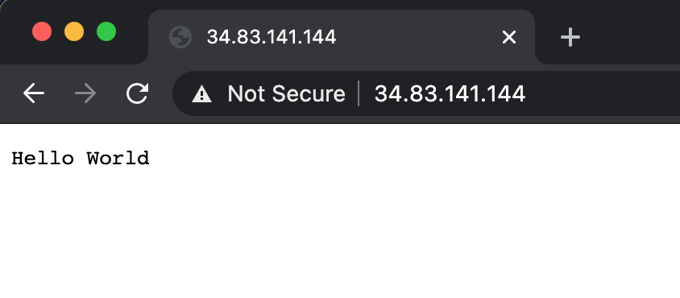
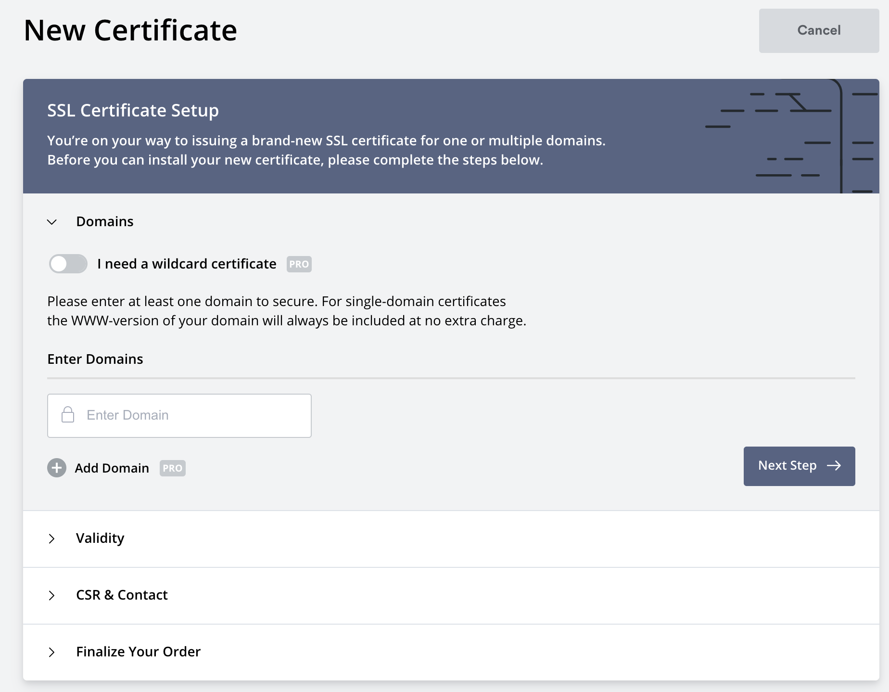

目前，必须使用 SSL 证书。它们通过加密来帮助保护服务器和客户端之间发送的数据，从而使您的网站更具信誉。本节将探讨几种不同的方法来获取 SSL 证书并将[Istio 网关](https://istio.io/latest/docs/reference/config/networking/gateway/)配置为使用它们。

我们将学习如何手动创建自签名证书，然后获取真实的 SSL 证书并进行设置。正如您将看到的，设置所有这些并不太复杂。

## 先决条件

为了继续学习，您将需要一个实际的，由云托管的 Kubernetes 集群。需要一个云托管群集，因为我们需要一个外部 IP 地址来连接域名。当然，您还需要一个域名。

您可以按照[先决条件](../prerequisites)获取有关如何安装和设置 Istio 的说明。

## 部署样本应用程序

为了确保所有内容都能正常工作，我们将首先部署一个简单的 Hello World Web 应用程序。如果您要使用自己的应用程序 / 服务，请随时使用。否则，您可以继续使用并使用该 `gcr.io/tetratelabs/hello-world:1.0.0` 镜像。

```sh
kubectl create deploy helloworld --image=gcr.io/tetratelabs/hello-world:1.0.0 --port=3000
```

接下来，让我们为其创建一个 Kubernetes 服务。

```yaml
apiVersion: v1
kind: Service
metadata:
  name: helloworld
  labels:
    app: helloworld
spec:
  ports:
  - name: http
    port: 80
    targetPort: 3000
  selector:
    app: helloworld
```

将上述 YAML 复制到`helloworld-svc.yaml`并使用进行部署`kubectl apply -f helloworld-svc.yaml`。

> 请注意，我们没有使用`kubectl expose`命令，因为我们需要在 Kubernetes 服务（例如`http`）中命名端口，而我们不能通过暴露命令来做到这一点。

要从外部 IP 访问服务，我们还需要一个网关资源：

```yaml
apiVersion: networking.istio.io/v1alpha3
kind: Gateway
metadata:
  name: public-gateway
spec:
  selector:
    istio: ingressgateway
  servers:
    - port:
        number: 80
        name: http
        protocol: HTTP
      hosts:
        - '*'
```

将上述 YAML 保存到`gateway.yaml`并使用进行部署`kubectl apply -f gateway.yaml`。

> 注意：该`hosts`字段的值为`*`。在为域名创建 SSL 证书后，我们将更改此字段的值。该值将是实际的域名。

最后，我们还需要一个 VirtualService，将流量路由到 `helloworld` Kubernetes 服务：

```yaml
apiVersion: networking.istio.io/v1alpha3
kind: VirtualService
metadata:
  name: helloworld
spec:
  hosts:
    - '*'
  gateways:
    - public-gateway
  http:
    - route:
      - destination:
          host: helloworld.default.svc.cluster.local
          port:
            number: 80
```

将上述 YAML 保存到`helloworld-vs.yaml`并使用进行部署`kubectl apply -f helloworld-vs.yaml`。

部署了所有这些资源后，您现在可以获取 Istio 入口网关的外部 IP：

```sh
kubectl get svc -l istio=ingressgateway -n istio-system
```

如果打开`EXTERNAL-IP`列中显示的 IP ，您将看到与下图相似的内容。



我们从应用程序中获得了响应，但也`Not Secure`从浏览器中获得了消息，该消息告诉用户连接不安全，也没有给人很大的信心。

## 自签名证书和手动设置

让我们从最简单的场景开始，我们手动获得证书。首先 - 选择您要使用的域 - 请注意，要进行测试，您不必拥有实际的域名，因为我们将使用自签名证书。

> 自签名证书未由证书颁发机构（CA）签名。您将使用这些证书进行开发和测试。但是，它们不提供由 CA 签名的证书提供的所有安全功能。

我将使用`mysuperdomain.com`我的域名。

```sh
export DOMAIN_NAME=mysuperdomain.com
```

第一步，我们将创建根证书（`$DOMAIN_NAME.crt`）和用于对证书进行签名的私钥（`$DOMAIN_NAME.key`）：

```sh
openssl req -x509 -sha256 -nodes -days 365 -newkey rsa:2048 -subj '/O=$DOMAIN_NAME Inc./CN=$DOMAIN_NAME' -keyout $DOMAIN_NAME.key -out $DOMAIN_NAME.crt
```

上面的命令创建一个`.crt`和`.key`文件。

接下来，我们需要创建私钥和签名请求：

```sh
openssl req -out helloworld.$DOMAIN_NAME.csr -newkey rsa:2048 -nodes -keyout helloworld.$DOMAIN_NAME.key -subj "/CN=helloworld.$DOMAIN_NAME/O=hello world from $DOMAIN_NAME"
```

最后，我们可以创建证书：

```sh
openssl x509 -req -days 365 -CA $DOMAIN_NAME.crt -CAkey $DOMAIN_NAME.key -set_serial 0 -in helloworld.$DOMAIN_NAME.csr -out helloworld.$DOMAIN_NAME.crt
```

现在您已经有了证书和密钥，您可以创建 Kubernetes Secret 来存储证书和密钥。

必须调用带有证书的 secret，`istio-ingressgateway-certs,`我们必须将其部署到`istio-system` 命名空间。这样，Istio 入口网关将自动加载 secret。

```sh
kubectl create secret tls istio-ingressgateway-certs -n istio-system --key helloworld.$DOMAIN_NAME.key --cert helloworld.$DOMAIN_NAME.crt
```

设置好 secret 之后，让我们更新网关资源，并告诉它使用此证书和私钥：

```sh
cat <<EOF | kubectl apply -f -
apiVersion: networking.istio.io/v1alpha3
kind: Gateway
metadata:
  name: public-gateway
spec:
  selector:
    istio: ingressgateway
  servers:
  - port:
      number: 443
      name: https
      protocol: HTTPS
    tls:
      mode: SIMPLE
      # These are coming from the istio-ingressgateway-certs secret
      serverCertificate: /etc/istio/ingressgateway-certs/tls.crt
      privateKey: /etc/istio/ingressgateway-certs/tls.key
    hosts:
    - helloworld.$DOMAIN_NAME
EOF
```

同样，我们需要使用设置为`$DOMAIN_NAME`环境变量的域名来更新 VirtualService 中的 hosts 字段：

```sh
cat <<EOF | kubectl apply -f -
apiVersion: networking.istio.io/v1alpha3
kind: VirtualService
metadata:
  name: helloworld
spec:
  hosts:
    - helloworld.$DOMAIN_NAME
  gateways:
    - public-gateway
  http:
    - route:
      - destination:
          host: helloworld.default.svc.cluster.local
          port:
            number: 80
EOF
```

测试此功能最简单的方法是使用 cURL 和该`--resolve`标志。

resolve 标志的格式为`[DOMAIN]:[PORT]:[IP]`，它将与该`[DOMAIN]:[PORT]`部分匹配的所有请求路由到指定的 IP 地址。这样，我们无需访问 DNS / 域注册商的网站并进行更改即可对其进行测试，并且我们可以使用一个甚至不存在的域。

本例中的 IP 地址是入口网关的外部 IP 地址。让我们将网关的 IP 地址保存到`EXTERNAL_IP`环境变量中：

```sh
export EXTERNAL_IP=$(kubectl get svc istio-ingressgateway -n istio-system -o jsonpath='{.status.loadBalancer.ingress[0].ip}')
```

最后，让我们使用此 cURL 命令来测试 SSL 证书是否得到验证和使用：

```sh
curl -v --resolve helloworld.$DOMAIN_NAME:443:$EXTERNAL_IP --cacert $DOMAIN_NAME.crt https://helloworld.$DOMAIN_NAME
```

我们告诉 cURL`helloworld.mysuperdomain.com:443`使用上述命令将对入站网关的外部 IP 地址的所有请求解析为。此外，我们提供了先前创建的 CA 证书的名称。

从输出中，您将能够看到服务器证书的详细信息以及显示该证书已验证的行以及`helloworld`Pod 的实际响应：

```text
...
* Server certificate:
*  subject: CN=helloworld.mysuperdomain.com; O=hello world from mysuperdomain.com
*  start date: Feb 2 23:32:11 2021 GMT
*  expire date: Feb 2 23:32:11 2022 GMT
*  common name: helloworld.mysuperdomain.com (matched)
*  issuer: O=mysuperdomain.com Inc.; CN=mysuperdomain.com
*  SSL certificate verify ok.
...
Hello World
```

## 真实签名的证书和手动设置

上一节中的自签名证书路径对于踢轮胎和测试事物很有用。我们将需要由您的客户可以信任的真实证书颁发机构（CA）签名的证书。

有两种方法可以获取 SSL 证书。最受欢迎的是[Let's Encrypt](https://letsencrypt.org/)。我们将使用[SSL For Free](https://www.sslforfree.com/)，它使用 Let's Encrypt 颁发证书。如果您想花钱，还可以从域注册商或[DigiCert](https://digicert.com/)购买 SSL 证书。

在本节中，我们将使用真实的域名和实际的 SSL 证书——这意味着，如果您想继续学习，请确保已准备好要使用的域。

注册域后，[免费](https://sslforfree.com/)打开 [SSL](https://sslforfree.com/) 以获取 SSL 证书。请注意，您将必须注册一个免费帐户才能创建 SSL 证书。

1. 输入您的域名，例如`mydomain.com`在文本字段中。
2. 单击创建免费 SSL 证书按钮。
3. 在仪表板上，单击 “**New Certificate”**按钮。



1. 输入域名，然后单击**下一步**按钮。
2. 选择 90 天证书选项，然后单击下一步。
3. 确认自动生成 CSR 选项，然后单击 “下一步”。
4. 在最后一页上，选择 “**免费”**选项，然后单击 “下一步”。

创建证书后，我们将需要验证域名并证明我们拥有为其创建 SSL 证书的域名。

可以使用三个选项来验证域：电子邮件验证（确保在域上设置了电子邮件），DNS（CNAME）验证和 HTTP 文件上传。


您可以使用这些选项中的任何一个。我将使用 CNAME 验证。CNAME 验证涉及登录到您的域注册商，并设置具有特定值的 CNAME 记录。

### 设置姓名记录

登录到域名注册商的网站后，我们还要为该域创建一个 A 记录，该记录将指向您的群集的外部 IP 地址。

由于我们请求 mydomain.com 和[www.mydomain.com](http://www.mydomain.com/)的证书，因此 A 记录应指向`mydomain.com`IP 地址。

### 验证域

设置 A 记录和 CNAME 之后，可以单击 “**验证域”**按钮。请注意，值传播和验证域可能需要一些时间。

验证域后，将颁发证书，您将能够下载包含生成文件的 ZIP 包。

该软件包将包含以下文件：

- ca_bundle.crt
- certificate.crt
- 私钥

### 重新创建秘密

让我们删除现有`ingressgateway-certs`机密，并使用真实证书创建一个新机密：

```sh
kubectl delete secret istio-ingressgateway-certs -n istio-system
```

我们可以使用从下载的软件包中获得的真实 SSL 证书和密钥来重新创建 Secret：

```sh
kubectl create secret tls istio-ingressgateway-certs -n istio-system --key private.key --cert certificate.crt
```

我们还需要更新网关和 VirtualService 来修改主机名。

让我们先更新网关（确保将其更新`mysuperdomain.com`为您的实际域名）：

```sh
cat <<EOF | kubectl apply -f -
apiVersion: networking.istio.io/v1alpha3
kind: Gateway
metadata:
  name: public-gateway
spec:
  selector:
    istio: ingressgateway
  servers:
  - port:
      number: 443
      name: https
      protocol: HTTPS
    tls:
      mode: SIMPLE
      # These are coming from the istio-ingressgateway-certs secret
      serverCertificate: /etc/istio/ingressgateway-certs/tls.crt
      privateKey: /etc/istio/ingressgateway-certs/tls.key
    hosts:
    - mysuperdomain.com
EOF
```

同样，对 VirtualService 进行更改：

```sh
cat <<EOF | kubectl apply -f -
apiVersion: networking.istio.io/v1alpha3
kind: VirtualService
metadata:
  name: helloworld
spec:
  hosts:
    - mysuperdomain.com
  gateways:
    - public-gateway
  http:
    - route:
      - destination:
          host: helloworld.default.svc.cluster.local
          port:
            number: 80
EOF
```

随着这两个资源的更新，您可以打开所选的浏览器并导航到域。您应该`Hello World!`在域名显示网站安全之前看到响应和挂锁。如果单击挂锁并检查证书，您将在证书中看到您的域名，以及根授权（Let's Encrypt）和到期日期。